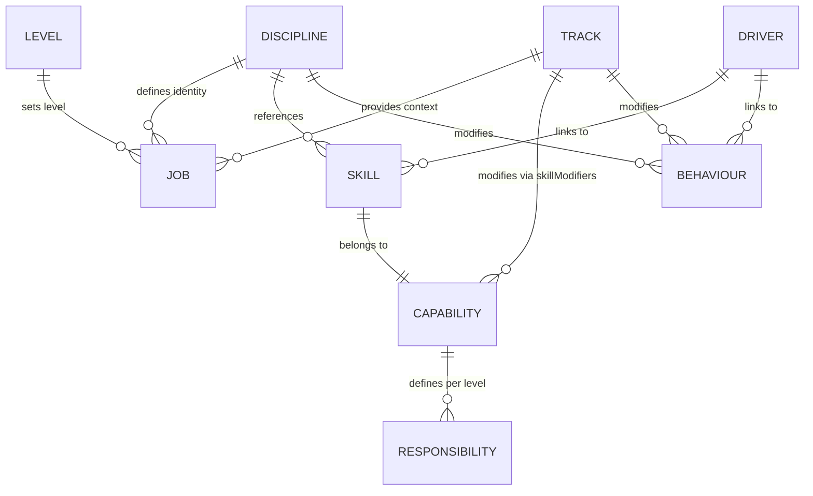
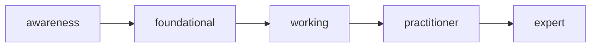
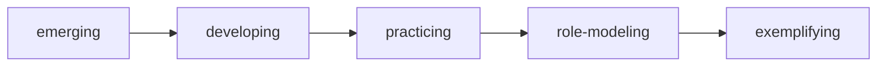

## Overview

The core model defines how you traverse your engineering terrain. Every
combination of discipline, track, and level produces a unique, consistent role
profile. The skill proficiencies, behaviour expectations, and responsibilities
come from the same source data.

---

## The Core Formula

**Job Definition** = Discipline x Track x Level

**Agent Profile** = Discipline x Track

| Input          | Question                   |
| -------------- | -------------------------- |
| **Discipline** | What kind of engineer?     |
| **Track**      | Where and how do you work? |
| **Level**      | What career level?         |

Both jobs and agents use the same skill and behaviour derivation. They differ in
one way. Jobs include all skills capped by level. Agents filter out human-only
skills.

---

## Entity Overview



| Entity         | Purpose                                        | Key Question              |
| -------------- | ---------------------------------------------- | ------------------------- |
| **Discipline** | Engineering specialty and T-shaped profile     | What kind of engineer?    |
| **Track**      | Work context and capability-based modifiers    | Where/how do you work?    |
| **Level**      | Career level with base skill/behaviour levels  | What career level?        |
| **Skill**      | Technical or professional capability           | What can you do?          |
| **Capability** | Skill group for modifiers and responsibilities | What capability area?     |
| **Behaviour**  | Approach to work and mindset                   | How do you approach work? |
| **Driver**     | Organizational outcome                         | What outcomes matter?     |

---

## Skills

Skills represent technical and professional capabilities. Each skill belongs to
exactly one capability.

### Skill Proficiencies (5 Levels)



| Proficiency    | Autonomy              | Scope                    |
| -------------- | --------------------- | ------------------------ |
| `awareness`    | with guidance         | team                     |
| `foundational` | with minimal guidance | team                     |
| `working`      | independently         | team                     |
| `practitioner` | lead, mentor          | area (2--5 teams)        |
| `expert`       | define, shape         | business unit / function |

### Human-Only Skills

Some skills require physical presence, emotional intelligence, or the ability to
build relationships. AI cannot replicate these. The YAML definition marks them
with `isHumanOnly: true`. Agent profile derivation excludes them.

---

## Capabilities

Capabilities group skills and define level-based responsibilities. Track
modifiers apply to all skills in a capability at once.

Capabilities also define:

- **professionalResponsibilities**: IC role expectations per skill proficiency
- **managementResponsibilities**: Manager role expectations per skill
  proficiency

Per-skill checklists (`readChecklist` and `confirmChecklist`) live on each
skill's `agent` section. They do not live on the capability. See
[Lifecycle](/docs/reference/lifecycle/).

---

## Behaviours

Behaviours represent mindsets and approaches to work.

### Behaviour Maturities (5 Levels)



| Maturity        | Description                                          |
| --------------- | ---------------------------------------------------- |
| `emerging`      | Shows interest, needs a prompt                       |
| `developing`    | Regularly applies with some guidance                 |
| `practicing`    | Consistently demonstrates in daily work              |
| `role-modeling` | Influences the team's approach. Others seek them out |
| `exemplifying`  | Shapes organizational culture in this area           |

---

## Disciplines

Disciplines define engineering specialties with T-shaped skill profiles. Each
discipline classifies every referenced skill into one of three tiers:

| Tier             | Expected Level    | Purpose                 |
| ---------------- | ----------------- | ----------------------- |
| coreSkills       | Highest for level | Core expertise          |
| supportingSkills | Mid-level         | Supporting capabilities |
| broadSkills      | Lower level       | General awareness       |

### Discipline Properties

| Property         | Type             | Purpose                                         |
| ---------------- | ---------------- | ----------------------------------------------- |
| `isProfessional` | boolean          | Uses professionalResponsibilities (IC roles)    |
| `isManagement`   | boolean          | Uses managementResponsibilities (manager roles) |
| `validTracks`    | (string\|null)[] | Valid track configurations                      |
| `minLevel`       | string           | Minimum level required for this discipline      |

---

## Tracks

Tracks define work context and modify the base profile through capability-based
skill adjustments. Tracks are pure modifiers. They do not define role types.

Tracks define two kinds of modifiers:

- **skillModifiers**: Shift skill proficiencies for all skills in a
  capability, for example `delivery: +1`
- **behaviourModifiers**: Shift behaviour maturity expectations for specific
  behaviours, for example `systems-thinking: +1`

---

## Levels

Levels define career levels with base expectations for skill proficiency and
behaviour maturity.

The starter agent-aligned engineering standard ships with two levels. Your
agent-aligned engineering standard may define more.

| Level | Core         | Supporting   | Broad     | Base Behaviour |
| ----- | ------------ | ------------ | --------- | -------------- |
| J040  | foundational | awareness    | awareness | emerging       |
| J060  | working      | foundational | awareness | developing     |

---

## Job Derivation

### Skill Derivation Steps

1. **Determine the skill tier.** Each discipline classifies every skill into
   one of three tiers: core, supporting, or broad. Find the tier the
   discipline assigns to this skill.

2. **Get the base proficiency.** Look up the level's base proficiency for that
   skill tier. For example, J060 maps core skills to `working`, supporting to
   `foundational`, and broad to `awareness`.

3. **Apply the track modifier.** Add the track's modifier for the skill's
   capability. Track modifiers apply at the capability level. They affect all
   skills in a capability equally.

4. **Cap positive modifiers.** Positive modifiers cannot push the result above
   the level's maximum base proficiency. If a level peaks at `practitioner`, a
   +1 modifier cannot produce `expert`.

5. **Clamp to the valid range.** Make sure the result falls between
   `awareness` (0) and `expert` (4).

### Complete Derivation Example

| Input      | Value                                                          |
| ---------- | -------------------------------------------------------------- |
| Discipline | Software Engineering                                           |
| Level      | J060 (core=working, supporting=foundational, broad=awareness)  |
| Track      | Forward Deployed (delivery: +1, reliability: -1)               |
| Skill      | Planning (capability: delivery, tier: supportingSkills)        |

1. **Skill tier**: supporting
2. **Base proficiency**: foundational (index 1)
3. **Modifier**: +1 (delivery capability)
4. **Cap check**: working (index 2) <= max base working (index 2), so OK
5. **Result**: working

---

## Behaviour Derivation

```text
Final Maturity = Level Base + Discipline Modifier + Track Modifier
```

| Step                | Source                    | Example        |
| ------------------- | ------------------------- | -------------- |
| Level base          | `baseBehaviourMaturity`   | developing (1) |
| Discipline modifier | `behaviourModifiers.{id}` | +1             |
| Track modifier      | `behaviourModifiers.{id}` | 0              |
| **Result**          | Clamped to valid range    | practicing (2) |

Behaviour derivation clamps maturities between `emerging` (0) and
`exemplifying` (4).

---

## Responsibility Derivation

Responsibilities come from capabilities and vary by role type:

| Role Type         | Source                                    |
| ----------------- | ----------------------------------------- |
| Professional (IC) | `capability.professionalResponsibilities` |
| Management        | `capability.managementResponsibilities`   |

The derived skill proficiency for each capability selects the responsibilities.
Higher skill proficiencies add more responsibilities.

---

## Driver Coverage

Drivers represent organizational outcomes. The coverage calculation checks which
skills and behaviours meet specific thresholds:

| Threshold          | Value               |
| ------------------ | ------------------- |
| Skill proficiency  | working or above    |
| Behaviour maturity | practicing or above |

Each driver lists `contributingSkills` and `contributingBehaviours`. For every
derived job, the thresholds above sort each contributing skill and behaviour
into `covered` or `missing`. The driver reports coverage ratios for both. The
coverage calculation runs at every level. There is no level gate. The driver
reports full coverage when every contributing skill and behaviour clears its
threshold.

---

## Modifier Policies

### Positive Modifier Capping

When a track modifier is positive, the result cannot exceed the level's maximum
base skill proficiency. A lower level then cannot gain high expertise only
because a track emphasizes a particular area.

### Negative Modifiers

The derivation does not cap negative modifiers. A negative modifier can reduce
a proficiency down to `awareness`. This models the reduced expectations in
de-emphasized areas.

### Capability-Level Modifiers

Track modifiers apply at the capability level. They affect all skills in that
capability equally. This avoids per-skill configuration. Tracks can still
differ in meaningful ways.

---

## Key Capabilities

| Capability         | What it does                                             |
| ------------------ | -------------------------------------------------------- |
| **Job derivation** | Complete role definitions with skills and behaviours     |
| **Agent profiles** | Agent instructions derived from discipline and track     |
| **Skill matrices** | Derived skill proficiencies with track modifiers applied |
| **Checklists**     | Phase transition criteria from per-skill definitions     |
| **Progression**    | Career path analysis and gap identification              |
| **Interviews**     | Role-specific question selection                         |
| **Job matching**   | Gap analysis between current and target roles            |

---

## What's next

<div class="grid">

<!-- part:card:../lifecycle -->
<!-- part:card:../yaml-schema -->

</div>
