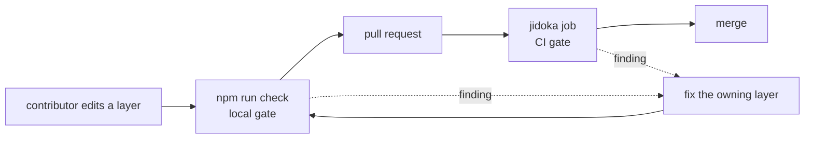

Your layers start clean. The agent profiles are short. The skill procedures are
complete. Six weeks later one profile has grown a procedure, and a generated
jobs block disagrees with the manifest it came from. An agent begins to make a
mistake nobody can attribute. Review caught none of it, because a reviewer
reads a diff and does not read a budget.

Jidoka builds the checking into the process. The `jidoka` command family is the
andon cord. It halts the moment a layer breaches its budget, a jobs block goes
stale, or one of your own invariants breaks. The fix then happens where the
defect appeared. The defect never reaches every downstream agent run.

This guide wires the checks into a repository you own. It covers what each
command catches, how to read a finding, and how to route it to the owning fix.

## Prerequisites

- [Adopt Jidoka in Your Repository](/docs/getting-started/) is complete. Your
  root `CLAUDE.md`, `CONTRIBUTING.md`, and `JTBD.md` exist, and
  `.jidoka/invariants/` holds at least one rule module.
- Node.js 22 or later, with `npx` on your path.
- Write access to the repository's check script and its CI workflow.

## One command per class of defect

Each command owns one class of defect. Attribution depends on that separation. A
length breach is a different problem from a stale jobs block, and each one
routes to a different fix.

| Command | What it reads | What it catches |
| --- | --- | --- |
| `jidoka instructions` | every instruction layer in the tree | a layer over its line cap or its word cap, a checklist block with too many items, a checklist item that explains |
| `jidoka jtbd` | every `package.json` that declares `jobs`, and the generated blocks those jobs feed | a job entry that breaks the schema, and a generated block that no longer matches its source |
| `jidoka invariants` | every `*.rules.mjs` module under `.jidoka/invariants/` | whatever rule your repository declared for itself |

Every command accepts `--json` for machine-readable findings. Run
`npx @forwardimpact/jidoka <command> --help` before you script against it.

### What `jidoka instructions` enforces

A line cap and a word cap gate every layer. Either breach fails.
[Put Your Instructions on One Layered Architecture](/docs/layered-instructions/)
carries the layer table. The word cap is the one that surprises people, because
it catches padded prose that still fits inside a passing line count.

These behaviours decide which files the check budgets.

- **Front matter is exempt.** The check strips a leading YAML block before it
  counts. A published copy of a skill therefore counts the same as its source in
  your repository.
- **Location and front matter set the layer.** A file in `.claude/agents/`
  counts as an agent profile when it carries both `name` and `description` front
  matter. Without them it counts as an agent reference, which has a far larger
  budget. The agent loader applies the same test. So a long reference that gains
  `name` and `description` flips to the tight profile budget and fails.
- **The walk skips non-instruction trees.** It ignores version-control,
  dependency, build, cache, temporary, and worktree directories, and a `wiki/`
  checkout, so agent memory never competes with instruction budgets.
- **Checklist blocks come from `CONTRIBUTING.md` and from each `SKILL.md`.**
  The check never gates a checklist you paste into an agent profile. Put
  universal gates
  in `CONTRIBUTING.md`. Put domain gates in the procedure that owns the pause
  point.

### What `jidoka jtbd` enforces

This command reports two unrelated kinds of trouble. The first is schema. Each
`jobs` entry must name a persona from the accepted set, and the finding prints
that set for you. Each entry needs a goal, a trigger, a competitor list, a Big
Hire, and a Little Hire. Each hire sentence ends with a period. No two entries
with different goals may claim the same hire sentence.

The second is freshness. Your job entries generate marker-delimited blocks in
the prose files that publish them. The check compares the generated text against
the manifest. It reports a mismatch as stale.

```sh
npx @forwardimpact/jidoka jtbd          # report schema and stale blocks
npx @forwardimpact/jidoka jtbd --fix    # regenerate the stale blocks in place
```

Order matters. A schema finding stops regeneration for the catalog that holds
it. So fix every schema finding first. Then run `--fix`. Then commit the
regenerated files. Never hand-edit text between the generated markers. The next
`--fix` overwrites your edit, and the check reports the same file as stale
forever.

One silent pass is worth planning for. The command reads job declarations from
the package directories that the
[Monorepo structure standard](https://www.monorepo.team/) defines. A repository
that keeps one hand-written `JTBD.md` and declares no package manifests gets a
passing `jtbd` run that validated nothing. So never read a green `jtbd` as proof
that your entries are good. That proof comes from
[Write Jobs To Be Done Entries](/docs/layered-instructions/write-jobs/).

### What `jidoka invariants` enforces

Nothing, until you write a rule. The command ships the engine. Your repository
owns the policies. The loader discovers every `*.rules.mjs` module under
`.jidoka/invariants/`. It searches upward from the working directory, so the
command behaves the same from any subdirectory.

A missing rules directory is an error:

```text
jidoka: error: rules directory not found: /srv/my-repo/.jidoka/invariants
```

That error is deliberate. A half-copied repository fails loudly instead of
reporting success over an empty policy set. To author a module, see
[Enforce Your Repository's Own Invariants](/docs/stop-the-line/write-invariant-rules/).

## Read a finding

Every check emits one finding format. Here is a run against a repository whose
identity file and one agent profile both grew past their caps.

```text
CLAUDE.md
    error  201 lines (max 192, root CLAUDE.md)   instructions.line-budget
           → trim prose to fit the layer cap, and see JIDOKA.md for the layered-instruction model
    error  1202 words (max 896, root CLAUDE.md)  instructions.word-budget
           → trim prose to fit the layer cap, and see JIDOKA.md for the layered-instruction model

.claude/agents/demo.md
    error  92 lines (max 72, agent profile)  instructions.line-budget
           → trim prose to fit the layer cap, and see JIDOKA.md for the layered-instruction model

✖ 3 problems (3 errors, 0 warnings)
```

Findings group under the file that owns them. Each finding names the measured
value, the cap it broke, the layer the check assigned, and the rule that fired.
The arrow line is the hint. It names the direction of the fix and never the
edit.

Two facts about the gate matter when you script it.

- **Any finding fails the run.** A rule may declare `warn` severity, and the
  output labels it a warning. The exit code stays non-zero. Severity documents
  intent and does not soften the gate.
- **Exit codes are stable.** A clean run exits `0`. A run with findings or stale
  blocks exits `1`. An unknown command exits `2`. Gate on the exit code. Read
  `--json` when a bot needs the structured fields.

## Run every check in one step

The bare command is the shortest thing to type, and it has one trap. It runs the
instruction check and the jobs check. It does not run your invariant modules.

```text
jidoka                # instruction caps and jobs, together
jidoka instructions   # layer length and checklist caps only
jidoka jtbd --fix     # regenerate the stale generated blocks
jidoka invariants     # your repository's own rule modules
```

So a single bare call leaves the rules you wrote yourself unenforced, and
`.jidoka/invariants/` looks green because nothing ran it. Wire two calls
everywhere you wire one:

```sh
npx @forwardimpact/jidoka
npx @forwardimpact/jidoka invariants
```

Keep them as separate calls rather than one combined script line. The log then
names which class of defect stopped the line, and a contributor reaches the
right fix without reading the whole output.

## Wire it into your check script

Add the CLI as a development dependency of the repository. An `npm` script then
resolves the bare `jidoka` name from the local install, with no global state.

```json
{
  "devDependencies": {
    "@forwardimpact/jidoka": "^0.2.0"
  },
  "scripts": {
    "check:instructions": "jidoka",
    "check:invariants": "jidoka invariants",
    "check": "npm run check:instructions && npm run check:invariants"
  }
}
```

Record the concrete command in `CONTRIBUTING.md`, beside the repository's other
quality commands. Contributors and agents both read that file to learn how to
verify their work.

Never wire a form that only resolves on a machine somebody already provisioned.
A `jidoka` binary sitting on your own `PATH` hides an invocation that a clean
runner cannot resolve. The check then passes for you and fails for everyone
else. Test the wiring the way CI runs it, from a fresh checkout.

## Wire it into CI

The same two calls belong on the pull request. Use the identical commands in
both places, so a contributor can reproduce a CI failure with one local run.

```yaml
name: jidoka
on: [pull_request]

jobs:
  instructions:
    runs-on: ubuntu-latest
    steps:
      - uses: actions/checkout@v4
      - uses: actions/setup-node@v4
        with:
          node-version: 22
      - run: npm ci
      - run: npm run check:instructions
      - run: npm run check:invariants
```



These decisions come up when teams wire this for the first time.

- **One job, separate steps.** A single job keeps the setup cost down. Separate
  steps keep the failure attributable in the run summary.
- **Never run `--fix` in CI on a protected branch.** The flag writes files.
  Regeneration belongs in a contributor's commit, where a human reviews the
  generated diff.
- **Turn the gate on after the repository is clean.** A first run usually
  reports a backlog. Fix it on its own branch, then make the job required. A
  required check that fails on day one teaches the team to ignore it.

A published composite action also exists. It takes an optional `command` input,
and it assumes a pinned `jidoka` binary is already on `PATH`. The action carries
no `npx` fallback, so adopt it only when
[the platform bootstrap](https://www.gemba.team/docs/getting-started/) runs
ahead of it in the same job.

```yaml
- uses: forwardimpact/jidoka@v1
  with:
    command: invariants
```

## Triage each finding to the fix that owns it

Group the findings by command before you change anything. Then route each
group.

| Finding from | What it means | Route to |
| --- | --- | --- |
| `instructions` (budget) | a layer exceeds its line cap or word cap | [Author or Repair One Instruction Layer](/docs/layered-instructions/author-a-layer/) |
| `instructions` (checklist) | a block holds too many items, or an item explains | [Write a Checklist That Verifies Instead of Teaches](/docs/layered-instructions/write-checklists/) |
| `jtbd` (schema) | an entry breaks the jobs structure | [Write Jobs To Be Done Entries](/docs/layered-instructions/write-jobs/) |
| `jtbd` (stale block) | a generated block is out of date | `jidoka jtbd --fix`, then commit the result |
| `invariants` | one of your rule modules flagged code | the hint that rule prints, then [Enforce Your Repository's Own Invariants](/docs/stop-the-line/write-invariant-rules/) |

Fix the cause. Do not fix the symptom.

- **A budget breach is a placement problem.** Do not cut words until the layer
  fits. Move the content to the layer that owns it. A template or a lookup table
  belongs in a skill reference. A procedure belongs in a skill procedure and
  never in an agent profile. The budget signals that content sits one layer too
  high.
- **A stale block is a source problem.** Edit the manifest, then regenerate.
- **An invariant violation is a code problem.** Fix the code the rule objects
  to. Never widen an allow-list to silence a finding. Never delete the rule
  because it is inconvenient this week.

Re-run the suite after each fix, because one fix can expose the next. When you
trim a profile, a checklist can move into a file that gates checklist blocks.
The check then measures that block for the first time. A clean run is the bar.

## Grandfather only during a real migration

Sometimes a new invariant lands on a codebase that already violates it. Then the
rule module carries an optional seed path. The seed prints a deny-list of the
known violations, and the module reads that list back, so the existing cases
pass and new ones fail.

```sh
npx @forwardimpact/jidoka invariants --seed <module-name>
```

Treat the list as monotone. Each migration commit removes entries. No commit
ever adds one. A grandfather list that grows is an allow-list wearing a
disguise, and it retires the invariant without anyone deciding to.

## Record what recurs

The check names which layer broke. It does not name why the same layer keeps
breaking. Keep a short note of the finding classes that return.

When one class returns again and again, the layer that should prevent it is
incomplete. Do not blame the contributor who tripped the gate. Strengthen the
procedure, the reference, or the invariant that should have made the mistake
impossible. A check that fires every week trains people to ignore every check.

## Migrate from the Co-Aligned era

This standard shipped previously under the name Co-Aligned. A repository still
on the old tools moves across in three steps.

1. Rename the rules directory with `git mv .coaligned .jidoka`.
2. Reinstall the skill pack with `apm install forwardimpact/jidoka-skills`.
3. Swap the CLI. The old `coaligned` command becomes `jidoka`. Update the check
   script, the CI workflow, and the command recorded in `CONTRIBUTING.md`.

An unmigrated repository fails loudly. The loader stops with a `rules directory
not found` error that names the location it expected.

## Verify

- `npx @forwardimpact/jidoka` and `npx @forwardimpact/jidoka invariants` both
  report a clean pass from a fresh clone and a fresh install.
- `npm run check` runs both commands, and `CONTRIBUTING.md` records that
  command.
- The andon cord works. Paste a paragraph into an agent profile until it goes
  over its cap. Run the check, and confirm the finding names that file. Then
  revert the paste.
- The invariant leg works. Confirm that `jidoka invariants` reports an error
  when `.jidoka/invariants/` is absent, and a pass when your module is in place.
- A pull request with a deliberate defect fails the CI job, and the run summary
  names the step that stopped.

## What's next

<div class="grid">

<!-- part:card:write-invariant-rules -->

<!-- part:card:../layered-instructions -->

<!-- part:card:../layered-instructions/author-a-layer -->

<!-- part:card:../layered-instructions/write-checklists -->

<!-- part:card:../layered-instructions/write-jobs -->

<!-- part:card:../getting-started -->

</div>
