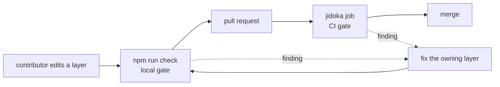

Your layers start clean, with short agent profiles and complete skill
procedures. Six weeks later, one profile has grown a procedure, and a generated
jobs block disagrees with the manifest it came from. An agent starts to make a
mistake that no one can trace to a file. Review catches none of it, because a
reviewer reads a diff and does not check a budget.

Jidoka builds the checking into the process. The `jidoka` command family stops
the line when a layer breaks its budget, a jobs block goes stale, or one of your
own invariants breaks. The fix then happens where the defect appeared, and the
defect never reaches the agent runs that come after it.

This guide adds the checks to a repository you own. It covers what each command
catches, how to read a finding, and how to route the finding to the fix that
owns it.

## Prerequisites

- [Adopt Jidoka in Your Repository](/docs/getting-started/) is complete. Your
  root `CLAUDE.md`, `CONTRIBUTING.md`, and `JTBD.md` exist, and
  `.jidoka/invariants/` contains at least one rule module.
- Node.js 22 or later, with `npx` on your path.
- `@forwardimpact/jidoka` installed as a development dependency, so that
  `npx jidoka` runs from the local install.
- Write access to the repository's check script and its CI workflow.

## One command per class of defect

Each command owns one class of defect. You can trace a finding to a fix because
of that separation. A length breach is a different problem from a stale jobs
block, and each one has a different fix.

| Command | What it reads | What it catches |
| --- | --- | --- |
| `jidoka instructions` | every instruction layer in the tree | a layer over its line cap or its word cap, a checklist block with too many items, a checklist item that explains |
| `jidoka jtbd` | every `package.json` that declares `jobs`, and the generated blocks those jobs feed | a job entry that breaks the schema, and a generated block that no longer matches its source |
| `jidoka invariants` | every `*.rules.mjs` module under `.jidoka/invariants/` | the rules your repository declared for itself |

Every command accepts `--json` for machine-readable findings. Run
`npx jidoka <command> --help` before you script against it.

### What `jidoka instructions` enforces

Every layer has a line cap and a word cap, and the check fails on either
breach.
[Put Your Instructions on One Layered Architecture](/docs/layered-instructions/)
has the layer table. The word cap catches padded prose that still fits inside
the line cap, so it can fail a file that the line cap passes.

These rules decide which files the check applies a budget to.

- **Front matter is exempt.** The check strips a leading YAML block before it
  counts. A published copy of a skill therefore counts the same as its source in
  your repository.
- **Location and front matter set the layer.** A file in `.claude/agents/`
  counts as an agent profile when it has both `name` and `description` front
  matter. Without them it counts as an agent reference, which has a much larger
  budget. The agent loader applies the same test. A long reference that gains
  `name` and `description` therefore moves to the small profile budget and
  fails.
- **The check skips directories that hold no instructions.** It ignores
  version-control, dependency, build, cache, temporary, and worktree
  directories, and a `wiki/` checkout, so agent memory never counts against an
  instruction budget.
- **Checklist blocks come from `CONTRIBUTING.md` and from each `SKILL.md`.**
  The check never measures a checklist that you paste into an agent profile.
  Put universal gates in `CONTRIBUTING.md`, and put domain gates in the
  procedure that owns the pause point.

### What `jidoka jtbd` enforces

This command reports two unrelated kinds of problem. The first is a schema
problem. Each `jobs` entry must use a persona from the accepted set, and the
finding prints that set for you. An entry also needs a goal, a trigger, a
competitor list, a Big Hire, and a Little Hire. Every hire sentence ends with a
period, and two entries with different goals must not use the same hire
sentence.

The second is a stale block. Your job entries generate marker-delimited blocks
in the prose files that publish them. The check compares the generated text
with the manifest and reports a mismatch as stale.

```sh
npx jidoka jtbd          # report schema and stale blocks
npx jidoka jtbd --fix    # regenerate the stale blocks in place
```

The order matters. A schema finding stops regeneration for the catalog that
contains it. Fix every schema finding first, then run `--fix`, then commit the
regenerated files. Never hand-edit text between the generated markers. The next
`--fix` overwrites your edit, and the check reports the same file as stale every
time.

Be aware of one case where the check passes without checking anything. The
command reads job declarations from the package directories that the
[Monorepo structure standard](https://www.monorepo.team/) defines. A repository
that keeps one hand-written `JTBD.md` and declares no package manifests gets a
passing `jtbd` run that validated nothing. Do not treat a green `jtbd` run as
proof that your entries are good. That proof comes from
[Write Jobs To Be Done Entries](/docs/layered-instructions/write-jobs/).

### What `jidoka invariants` enforces

It enforces nothing until you write a rule. The command ships the engine, and
your
repository owns the policies. The loader finds every `*.rules.mjs` module under
`.jidoka/invariants/`. It searches upward from the working directory, so the
command works the same from any subdirectory.

A missing rules directory is an error:

```text
jidoka: error: rules directory not found: /srv/my-repo/.jidoka/invariants
```

The error is intended. A half-copied repository fails with a clear message
instead of reporting success over an empty policy set. To write a module, see
[Enforce Your Repository's Own Invariants](/docs/stop-the-line/write-invariant-rules/).

## Read a finding

Every check uses the same finding format. Here is a run against a repository
where the identity file and one agent profile both grew past their caps.

```text
CLAUDE.md
    error  201 lines (max 192, root CLAUDE.md)   instructions.line-budget
           → trim prose to fit the layer cap, and see JIDOKA.md for the layered-instruction model
    error  1202 words (max 896, root CLAUDE.md)  instructions.word-budget
           → trim prose to fit the layer cap, and see JIDOKA.md for the layered-instruction model

.claude/agents/demo.md
    error  92 lines (max 72, agent profile)  instructions.line-budget
           → trim prose to fit the layer cap, and see JIDOKA.md for the layered-instruction model

✖ 3 problems (3 errors, 0 warnings)
```

Findings are grouped under the file that owns them. Each finding shows the
measured value, the cap it broke, the layer the check assigned, and the rule the
file broke. The arrow line is the hint. It gives the direction of the fix and
not the exact edit.

Note two points when you script against the gate.

- **Any finding fails the run.** A rule can declare `warn` severity, and the
  output then labels the finding a warning, but the exit code stays non-zero.
  Severity records the intent of the rule and does not change the gate.
- **Exit codes are stable.** A clean run exits `0`. A run with findings or stale
  blocks exits `1`. An unknown command exits `2`. Gate on the exit code, and
  read `--json` when a bot needs the structured fields.

## Run every check in one step

The bare command is the shortest command to type, and it has one trap. It runs
the instruction check and the jobs check, but it does not run your invariant
modules.

```text
jidoka                # instruction caps and jobs, together
jidoka instructions   # layer length and checklist caps only
jidoka jtbd --fix     # regenerate the stale generated blocks
jidoka invariants     # your repository's own rule modules
```

A single bare call therefore leaves the rules you wrote yourself unenforced,
and `.jidoka/invariants/` looks green because nothing ran it. Add two calls
everywhere you add one:

```sh
npx jidoka
npx jidoka invariants
```

Keep them as separate calls instead of one combined script line. The log then
shows which class of defect stopped the line, and a contributor can find the
right fix without reading the whole output.

## Wire it into your check script

Add the CLI as a development dependency of the repository. An `npm` script then
finds the bare `jidoka` name in the local install, with no global state.

```sh
npm install --save-dev @forwardimpact/jidoka
```

The manifest then contains the dependency and the scripts that call it:

```json
{
  "devDependencies": {
    "@forwardimpact/jidoka": "^0.2.0"
  },
  "scripts": {
    "check:instructions": "jidoka",
    "check:invariants": "jidoka invariants",
    "check": "npm run check:instructions && npm run check:invariants"
  }
}
```

Record the exact command in `CONTRIBUTING.md`, next to the repository's other
quality commands. Contributors and agents both read that file to learn how to
verify their work.

Never use a form of the command that only works on a machine that someone
already set up. A `jidoka` binary on your own `PATH` hides a command that a
clean runner cannot find. The check then passes for you and fails for everyone
else. Test the wiring the way CI runs it, from a fresh checkout.

## Wire it into CI

The same two calls belong in the pull request checks. Use the same commands in
both places, so that a contributor can reproduce a CI failure with one local
run.

```yaml
name: jidoka
on: [pull_request]

jobs:
  instructions:
    runs-on: ubuntu-latest
    steps:
      - uses: actions/checkout@v4
      - uses: actions/setup-node@v4
        with:
          node-version: 22
      - run: npm ci
      - run: npm run check:instructions
      - run: npm run check:invariants
```


```mermaid
graph LR
    A["contributor edits a layer"] --> B["npm run check<br/>local gate"]
    B --> C["pull request"] --> D["jidoka job<br/>CI gate"] --> E["merge"]
    B & D -.->|finding| F["fix the owning layer"]
    F --> B
```

Teams face these decisions the first time they set this up.

- **Use one job with separate steps.** A single job keeps the setup cost down.
  Separate steps show which check failed in the run summary.
- **Never run `--fix` in CI on a protected branch.** The flag writes files.
  Regeneration belongs in a contributor's commit, where a human reviews the
  generated diff.
- **Turn the gate on after the repository is clean.** A first run usually
  reports a backlog of findings. Fix them on their own branch, then make the
  job required. If a required check fails from the first day, the team learns
  to ignore it.

A published composite action also exists. It takes an optional `command` input,
and it assumes that a pinned `jidoka` binary is already on `PATH`. The action
has no `npx` fallback, so use it only when
[the platform bootstrap](https://www.gemba.team/docs/getting-started/) runs
before it in the same job.

```yaml
- uses: forwardimpact/jidoka@v1
  with:
    command: invariants
```

## Triage each finding to the fix that owns it

Group the findings by command before you change anything. Then route each
group.

| Finding from | What it means | Route to |
| --- | --- | --- |
| `instructions` (budget) | a layer exceeds its line cap or word cap | [Author or Repair One Instruction Layer](/docs/layered-instructions/author-a-layer/) |
| `instructions` (checklist) | a block holds too many items, or an item explains | [Write a Checklist That Verifies Instead of Teaches](/docs/layered-instructions/write-checklists/) |
| `jtbd` (schema) | an entry breaks the jobs structure | [Write Jobs To Be Done Entries](/docs/layered-instructions/write-jobs/) |
| `jtbd` (stale block) | a generated block is out of date | `jidoka jtbd --fix`, then commit the result |
| `invariants` | one of your rule modules flagged code | the hint that rule prints, then [Enforce Your Repository's Own Invariants](/docs/stop-the-line/write-invariant-rules/) |

Each finding shows a symptom. Fix the cause behind it:

- **A budget breach is a placement problem.** Do not cut words until the layer
  fits. Move the content to the layer that owns it. A template or a lookup
  table belongs in a skill reference. A procedure belongs in a skill procedure
  and never in an agent profile. The budget shows that content is one layer
  too high.
- **A stale block is a source problem.** Edit the manifest, then regenerate.
- **An invariant violation is a code problem.** Fix the code that the rule
  rejects. Do not widen an allow-list to silence a finding, and do not delete
  the rule because it is inconvenient this week.

Run the suite again after each fix, because one fix can expose the next. When
you trim a profile, a checklist can move into a file that the check measures,
and the check then measures that block for the first time. Stop when the run is
clean.

## Grandfather only during a real migration

Sometimes a new invariant arrives in a codebase that already violates it. For
that case, the rule module can have an optional seed path. The seed prints a
deny-list of the known violations, and the module reads that list back, so the
existing cases pass and new ones fail.

```sh
npx jidoka invariants --seed <module-name>
```

The list must only shrink. Each migration commit removes entries, and no commit
adds one. A list that grows works as an allow-list, and it retires the
invariant without a decision from anyone.

## Record what recurs

The check shows which layer broke. It does not show why the same layer keeps
breaking. Keep a short note of the finding classes that come back.

When one class comes back again and again, the layer that should prevent it is
incomplete. Do not blame the contributor who tripped the gate. Improve the
procedure, the reference, or the invariant that should have made the mistake
impossible. If a check fails every week, people learn to ignore every check.

## Migrate from the Co-Aligned era

This standard was previously published under the name Co-Aligned. A repository
that still uses the old tools moves across in three steps.

1. Rename the rules directory with `git mv .coaligned .jidoka`.
2. Reinstall the skill pack with `apm install forwardimpact/jidoka-skills`.
3. Replace the CLI. The old `coaligned` command becomes `jidoka`. Update the
   check script, the CI workflow, and the command recorded in
   `CONTRIBUTING.md`.

A repository that has not migrated fails with a clear message. The loader stops
with a `rules directory not found` error that shows the location it expected.

## Verify

- `npx jidoka` and `npx jidoka invariants` both report a clean pass from a
  fresh clone and a fresh install.
- `npm run check` runs both commands, and `CONTRIBUTING.md` records that
  command.
- The budget check works. Paste a paragraph into an agent profile until it goes
  over its cap. Run the check, and confirm that the finding shows that file.
  Then revert the paste.
- The invariant check works. Confirm that `jidoka invariants` reports an error
  when `.jidoka/invariants/` is absent, and a pass when your module is in
  place.
- A pull request with a planted defect fails the CI job, and the run summary
  shows the step that stopped.

## What's next

<div class="grid">

<!-- part:card:write-invariant-rules -->

<!-- part:card:../layered-instructions -->

<!-- part:card:../layered-instructions/author-a-layer -->

<!-- part:card:../layered-instructions/write-checklists -->

<!-- part:card:../layered-instructions/write-jobs -->

<!-- part:card:../getting-started -->

</div>
