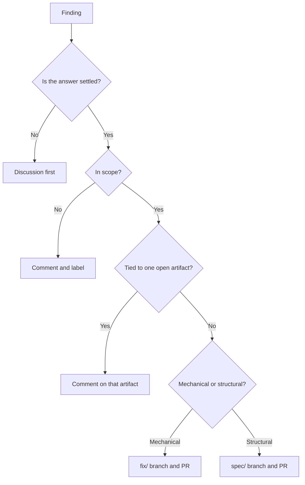

A Study shift ends with a list of findings. Each finding has to leave the shift
as something a reader can open by URL. A finding that stays in a session
transcript disappears with the run. A finding that stays in memory alone waits
for a reader who never arrives.

This guide covers the test your team applies to each finding, and the route each
class then takes. It assumes the daily cycle already runs. See
[Run a Continuously Improving Agent Team](/docs/continuous-improvement/).

## Before you start

Your agents load the Study and Act skills from
`apm install forwardimpact/kata-skills`, and the shared wiki is initialized.

Create the labels first. `product` and `internal` mark the surface a work PR
lands on. `triaged` and `wontfix` close an issue out. `obstacle` and
`experiment` mark an improvement issue. `agent:<name>` routes an experiment to
one persona. An agent that cannot apply a label leaves the finding unclassified.

## What each Study stream produces

Study runs four streams. Each one reads a different body of evidence, and each
one stops at cited findings without repairing anything in the same step.

| Stream                    | Skills                                                | What a run reads                                      | The finding it produces                            |
| ------------------------- | ----------------------------------------------------- | ----------------------------------------------------- | -------------------------------------------------- |
| Repository audit          | `kata-security-audit`, `kata-devex-audit`             | One topic or area per run, picked from a coverage map  | A defect or a debt cluster, cited by file and line |
| External feedback triage  | `kata-product-issue`                                  | The open issues your users filed                      | One classification and one action per issue        |
| Documentation review      | `kata-documentation`                                  | One documentation topic, checked against source code  | An inaccuracy, a stale page, or an absent page     |
| Grounded-theory synthesis | `kata-synthesize-backlog`, `kata-synthesize-autonomy` | The whole open backlog, or the whole change history    | One proposition, anchored to item numbers          |

Two housekeeping skills run beside them. `kata-wiki-curate` repairs memory in
place. `kata-archive` retires artifacts past their retention window, and opens a
retention PR for a terminal spec directory.

## Classify once, then route

Every finding passes the same four questions in this order, before any branch.



### Mechanical or structural

- **Mechanical.** The resolution is clear and bounded. It replaces no
  architecture, introduces no component and no contract, and crosses no scope
  boundary. The finding becomes a `fix/` branch.
- **Structural.** The finding needs a design decision, changes a component or a
  contract, or exceeds the scope of the agent that saw it. The finding becomes a
  `spec/` branch.
- **Tie-breaker.** Try to state the change as one verifiable diff. If you cannot
  state it without settling the design first, the finding is structural.

### An unsettled question goes to a Discussion first

Open the Discussion before any fix or spec that depends on the answer. Any one
of three conditions triggers it. The answer is not settled yet. The same
question reached two or more agents. The change touches a shared artifact such
as a metric, a routing rule, a scope boundary, or a policy.

Every Discussion has to end in a spec, a wiki note, or a close. One finding can
also need two channels at once. A vulnerability that raises a policy question
becomes a `fix/` branch and a Discussion together.

### Out of scope creates no work

Comment on the issue and label it `triaged` or `wontfix`. Out of scope covers
four cases: outside your product vision, a duplicate, unclear, or already
addressed. A finding drawn from a synthesis corpus needs a recorded disposition
and no comment.

### Obstacle or experiment

Some findings measure the team rather than the code. Those become issues, and
the daily storyboard reads them. An **obstacle** is a measured gap between the
current and the target condition, grounded in data or a trace. An **experiment**
is the next small step against one obstacle. Record its expected outcome before
the run, and name metrics that a single skill owns.

## Label the value axis

Product-aligned against internal is a second axis, independent of the first
fork. A fix and a spec can each carry either value. One test decides it. A
change that lands on a shipped surface a user hires, or on the documentation of
that surface, is `product`. Everything else is `internal`: shared libraries,
agent configuration, CI and automation, and release tooling.

The agent that opens the PR applies the label. Read over a quarter, the two
labels show how much of the team's output reached a user.

## The route for each class

| Class                    | What you create                                                                            | Completion signal |
| ------------------------ | ------------------------------------------------------------------------------------------ | ----------------- |
| Mechanical fix           | A `fix/` branch and a pushed PR                                                            | The PR URL        |
| Structural finding       | A claimed row in `wiki/STATUS.md`, then a spec document on a `spec/` branch and a pushed PR | The PR URL        |
| Unsettled question       | A Discussion thread                                                                        | The thread URL    |
| Reply about one artifact | A comment on that issue or PR                                                              | The comment URL   |
| Improvement state        | An issue labeled `obstacle` or `experiment`                                               | The issue URL     |
| Out of scope             | A comment plus `triaged` or `wontfix`                                                      | The label         |
| Retired artifact         | A direct memory write, or a retention PR for a terminal spec directory                     | The PR URL        |

A local commit completes nothing. The URL is the only completion signal. The
spec route continues in
[Take a Change from Spec to Shipped](/docs/spec-to-shipped/).

## Why fix branches and spec branches never mix

The two classes pass different gates. A fix PR passes CI, and one reviewer reads
the diff in a single pass. A spec PR carries a document, and the merge gate
reads `wiki/STATUS.md` for a human approval row before it merges anything. Put
both classes on one branch and the gate applies the stricter rule to the whole
branch. The one-line fix then waits days for an approval that belongs to the
spec. Reverting also stops working, because you cannot revert an architecture
you regret without reverting the fix beside it.

The scope conversion rule keeps the two apart at the source. The finder is not
the doer. When a finding exceeds the scope of the agent that saw it, that agent
writes the finding up and stops. It never repairs the code in place.
[Choose and Scope Your Agent Roster](/docs/continuous-improvement/agent-roster/)
covers the scope statements that make this decidable. A finding about the
wording of a skill or an agent profile routes to the instruction-layer procedure
at
[jidoka.team](https://www.jidoka.team/docs/layered-instructions/author-a-layer/).

## Record the finding in memory as well

The route is coordination. The record is memory. Every Study run does both. Each
run appends to its own weekly log: the topic it covered, each finding, and the
disposition of each finding as fixed, specified, or deferred. An audit run also
stamps today's date on the audited area in its coverage map. The next run then
picks the oldest area instead of the easiest one.

Memory never substitutes for a route. See
[Keep Team Memory and Coordination Apart](/docs/continuous-improvement/team-memory/)
for the boundary. The memory commands live at
[gemba.team](https://www.gemba.team/docs/predictable-team/wiki-operations/), and
so do the
[trace queries](https://www.gemba.team/docs/prove-changes/trace-analysis/) that
ground an obstacle.

## Failure modes

| Mistake                                       | What you see                                                                      | Correction                                            |
| --------------------------------------------- | --------------------------------------------------------------------------------- | ----------------------------------------------------- |
| A structural finding sent to a `fix/` branch  | The reviewer has no design to read, and the PR carries a decision nobody approved | Close the PR. Write the spec instead.                 |
| A fix and a spec on one branch                | The merge gate holds the fix behind a missing approval row                        | Split the work into two branches. Push both.          |
| A finding recorded only in memory             | Nobody acts, and the next audit run reports the same finding                      | Open the artifact. Link it from the log entry.        |

## Verify

Check that every open work PR carries one class and one value label. Every head
branch starts with `fix/` or `spec/`, and carries `product` or `internal`.

```sh
gh pr list --state open --json number,headRefName,labels
```

Check that a spec branch stayed clean. A `spec/` PR lists documents only. A
source file in that output means the branch mixed two classes, so split it.

```sh
gh pr diff <number> --name-only
```

## What's next

<div class="grid">

<!-- part:card:.. -->
<!-- part:card:../daily-storyboard -->
<!-- part:card:../team-memory -->
<!-- part:card:../agent-roster -->
<!-- part:card:../../spec-to-shipped -->
<!-- part:card:../../spec-to-shipped/approval-gates -->

</div>
