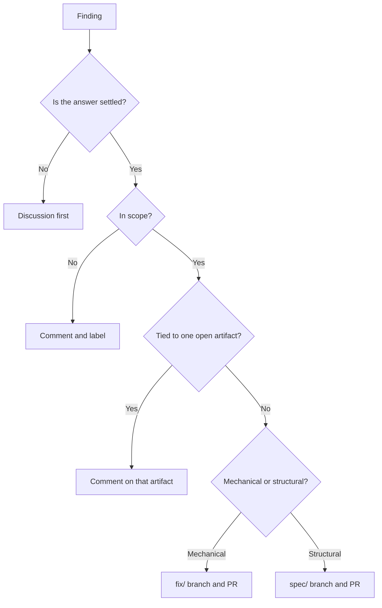

A Study shift ends with a list of findings. Each finding must leave the shift
as something that a reader can open by URL. A finding that stays in a session
transcript disappears with the run, and a finding that stays only in memory
waits for a reader who never comes.

This guide covers the test your team applies to each finding, and the route
each class then takes. It assumes the daily cycle already runs. See
[Run a Continuously Improving Agent Team](/docs/continuous-improvement/).

## Before you start

Your agents load the Study and Act skills from
`apm install forwardimpact/kata-skills`, and the shared wiki is initialized.

Create the labels first. `product` and `internal` mark the surface that a work
PR changes. `triaged` and `wontfix` close an issue. `obstacle` and
`experiment` mark an improvement issue, and `agent:<name>` routes an
experiment to one persona. An agent that cannot apply a label leaves the
finding unclassified.

## What each Study stream produces

Study runs three streams. Each one reads a different body of evidence, stops at
cited findings, and repairs nothing in the same step.

| Stream                    | Skills                                                | What a run reads                                      | The finding it produces                            |
| ------------------------- | ----------------------------------------------------- | ----------------------------------------------------- | -------------------------------------------------- |
| Repository audit          | `kata-security-audit`, `kata-devex-audit`             | One topic or area per run, picked from a coverage map  | A defect or a debt cluster, cited by file and line |
| External feedback triage  | `kata-product-issue`                                  | The open issues your users filed                      | One classification and one action per issue        |
| Documentation review      | `kata-documentation`                                  | One documentation topic, checked against source code  | An inaccuracy, a stale page, or a missing page     |

Two housekeeping skills run beside them. `kata-wiki-curate` repairs memory in
place. `kata-archive` retires artifacts that are past their retention window,
and it opens a retention PR for a terminal spec directory.

## Classify once, then route

Every finding goes through the same four questions in this order, before any
branch is created.


```mermaid
graph TD
    F["Finding"] --> Q1{"Is the answer settled?"}
    Q1 -- "No" --> DI["Discussion first"]
    Q1 -- "Yes" --> Q2{"In scope?"}
    Q2 -- "No" --> CL["Comment and label"]
    Q2 -- "Yes" --> Q3{"Tied to one open artifact?"}
    Q3 -- "Yes" --> CO["Comment on that artifact"]
    Q3 -- "No" --> Q4{"Mechanical or structural?"}
    Q4 -- "Mechanical" --> FX["fix/ branch and PR"]
    Q4 -- "Structural" --> SP["spec/ branch and PR"]
```

### Mechanical or structural

- **Mechanical.** The fix is clear and bounded. It does not replace
  architecture, add a component or a contract, or cross a scope boundary. The
  finding becomes a `fix/` branch.
- **Structural.** The finding needs a design decision, changes a component or a
  contract, or is outside the scope of the agent that found it. The finding
  becomes a `spec/` branch.
- **Tie-breaker.** Try to describe the change as one verifiable diff. If you
  cannot do that without a design decision first, the finding is structural.

### An unsettled question goes to a Discussion first

Open the Discussion before any fix or spec that depends on the answer. Any one
of three conditions requires it: the answer is not settled yet, the same
question reached two or more agents, or the change affects a shared artifact
such as a metric, a routing rule, a scope boundary, or a policy.

Every Discussion must end in a spec, a wiki note, or a close. One finding can
also need two channels. A vulnerability that raises a policy question becomes
both a `fix/` branch and a Discussion.

### Out of scope creates no work

Comment on the issue and label it `triaged` or `wontfix`. Out of scope covers
four cases: outside your product vision, a duplicate, unclear, or already
addressed. A finding from a synthesis corpus needs a recorded decision and no
comment.

### Obstacle or experiment

Some findings measure the team instead of the code. Those become issues, and
the daily storyboard reads them. An **obstacle** is a measured gap between the
current condition and the target condition, based on data or a trace. An
**experiment** is the next small step against one obstacle. Record its
expected outcome before the run, and use metrics that a single skill owns.

## Label the value axis

Product-aligned or internal is a second classification, independent of the
first. A fix and a spec can each have either value. One test decides it. A
change to a shipped surface that users work with, or to the documentation of
that surface, is `product`. Everything else is `internal`: shared libraries,
agent configuration, CI and automation, and release tooling.

The agent that opens the PR applies the label. Over a quarter, the two labels
show how much of the team's output reached users.

## The route for each class

| Class                    | What you create                                                                            | Completion signal |
| ------------------------ | ------------------------------------------------------------------------------------------ | ----------------- |
| Mechanical fix           | A `fix/` branch and a pushed PR                                                            | The PR URL        |
| Structural finding       | A claimed row in `wiki/STATUS.md`, then a spec document on a `spec/` branch and a pushed PR | The PR URL        |
| Unsettled question       | A Discussion thread                                                                        | The thread URL    |
| Reply about one artifact | A comment on that issue or PR                                                              | The comment URL   |
| Improvement state        | An issue labeled `obstacle` or `experiment`                                               | The issue URL     |
| Out of scope             | A comment plus `triaged` or `wontfix`                                                      | The label         |
| Retired artifact         | A direct memory write, or a retention PR for a terminal spec directory                     | The PR URL        |

A finding is complete only when it has a URL, so a local commit completes
nothing. The spec route continues in
[Take a Change from Spec to Shipped](/docs/spec-to-shipped/).

## Why fix branches and spec branches never mix

The two classes pass different gates. A fix PR passes CI, and one reviewer
reads the diff in one pass. A spec PR contains a document, and the merge gate
reads `wiki/STATUS.md` for a human approval row before it merges anything. If
you put both classes on one branch, the gate applies the stricter rule to the
whole branch. The one-line fix then waits days for an approval that belongs to
the spec. A revert also becomes harder, because you cannot revert a bad
architecture decision without reverting the fix beside it.

The scope rule keeps the two apart from the start. When a finding is outside
the scope of the agent that found it, that agent writes the finding up and
stops. It never repairs the code itself.
[Choose and Scope Your Agent Roster](/docs/continuous-improvement/agent-roster/)
covers the scope statements that make this decision clear. A finding about the
wording of a skill or an agent profile goes to the instruction-layer procedure
at
[jidoka.team](https://www.jidoka.team/docs/layered-instructions/author-a-layer/).

## Record the finding in memory as well

Routing a finding is coordination, and logging it is memory. Every Study run
does both.
Each run appends the topic it covered, each finding, and the decision for each
finding (fixed, specified, or deferred) to its own weekly log. An audit run
also writes today's date on the audited area in its coverage map, so that the
next run picks the oldest area instead of the easiest one.

Memory never replaces a route. See
[Keep Team Memory and Coordination Apart](/docs/continuous-improvement/team-memory/)
for the boundary. The memory commands are documented at
[gemba.team](https://www.gemba.team/docs/predictable-team/wiki-operations/), and
so are the
[trace queries](https://www.gemba.team/docs/prove-changes/trace-analysis/) that
support an obstacle.

## Failure modes

| Mistake                                       | What you see                                                                      | Correction                                            |
| --------------------------------------------- | --------------------------------------------------------------------------------- | ----------------------------------------------------- |
| A structural finding sent to a `fix/` branch  | The reviewer has no design to read, and the PR contains a decision that no one approved | Close the PR. Write the spec instead.           |
| A fix and a spec on one branch                | The merge gate holds the fix behind a missing approval row                        | Split the work into two branches. Push both.          |
| A finding recorded only in memory             | No one acts, and the next audit run reports the same finding                      | Open the artifact. Link it from the log entry.        |

## Verify

Check that every open work PR has one class and one value label. Every head
branch starts with `fix/` or `spec/` and has the `product` or `internal`
label.

```sh
gh pr list --state open --json number,headRefName,labels
```

Check that a spec branch stayed clean. A `spec/` PR lists documents only. A
source file in that output means the branch mixed two classes, so split it.

```sh
gh pr diff <number> --name-only
```

## What's next

<div class="grid">

<!-- part:card:.. -->
<!-- part:card:../daily-storyboard -->
<!-- part:card:../team-memory -->
<!-- part:card:../agent-roster -->
<!-- part:card:../../spec-to-shipped -->
<!-- part:card:../../spec-to-shipped/approval-gates -->

</div>
