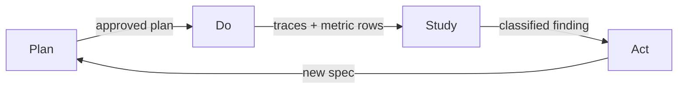

Your agents ship work every day. Nobody can say whether the team is getting
better. The only feedback loop you have is to read every diff, and that loop
stops scaling in the first week. Kata replaces it with a daily
Plan-Do-Study-Act cycle. The team plans from an approved spec, ships the plan,
studies its own traces, and acts on what it finds.

This guide walks the whole cycle once. You put the roster in shift order, give
the team one place to remember, then follow work through Plan, Do, Study, and
Act. At the end the loop turns without you inside it, and it leaves evidence of
what improved.

## Prerequisites

- A repository with GitHub Actions enabled and the repository wiki enabled
- `apm install forwardimpact/kata-skills` and
  `apm install forwardimpact/gemba-skills`
- The shift, storyboard, and dispatch workflows generated, with one green run
- One agent profile per role under `.claude/agents/`
- An `ANTHROPIC_API_KEY` secret, and a GitHub App the workflows authenticate as

[Getting Started: Your First Kata Shift](/docs/getting-started/) sets these up.
Kata ships no CLI of its own. It runs on the Gemba platform, and the workflows
call the [Gemba command family](https://www.gemba.team/) for sessions, memory,
traces, and metrics.

## The four phases and their handoffs

Every workflow belongs to exactly one phase. Each phase hands the next one a
named artifact. That handoff makes the cycle a loop. Without it, each phase
produces a report and stops.



| Phase | What enters | What the phase produces |
| --- | --- | --- |
| **Plan** | a spec a human already approved | a design, then an executable plan |
| **Do** | an approved plan, plus standing maintenance work | implementation PRs, releases, and one trace per run |
| **Study** | traces, PRs, issues, docs, and metric rows from Do | findings, each grounded in quoted evidence |
| **Act** | one finding at a time | a pushed fix PR, a pushed spec branch, or a Discussion |

The middle column tells you what to feed a phase. The right column tells you
what to demand back. A phase that produced nothing on its row did not run.

## Decide these before the first unattended cycle

- **Which roles run, and in what order.** One workflow runs the whole roster,
  one agent at a time. Declaration order decides who sees whose output.
- **What each role must not do.** Every profile carries explicit scope
  constraints. An agent with no stated scope acts on anything it notices, and a
  documentation review turns into a library refactor.
- **Who counts as a trusted human.** Approvals come from people you name. The
  optional `.kata/settings.json` file selects the trust source and the review
  rigor.
- **When the shifts start.** The templates schedule a night, a day, and a swing
  shift in your timezone. The storyboard runs after the night shift finishes.
- **Whether the team keeps memory.** With the wiki on, agents accumulate state
  across sessions. Every run starts cold without it.

## Step 1: Put the roster in shift order

The shift workflow runs the roster serially, one agent per matrix entry, with a
parallelism of one. Order the entries so the roster reads as a chain. Triage
runs first. Engineering runs next. Security and documentation review what
engineering produced. Shipping runs after review passes. The coach runs last,
because it assesses the shift that has finished.

Serial order is not a performance choice. Agents share one checkout and one
memory. Two agents that write the same file in the same minute hand you a merge
conflict, and neither run says which change the team intended.

Each agent selects its own work at boot. It reads the priorities it owns, then
its storyboard deliverables, then its domain checks, then the cross-cutting
work that lists it. The first level with real work wins. You do not write a
prompt per shift.

When a finding exceeds an agent's scope, the agent writes it up and leaves it.
The finder is not the doer. That rule is what keeps a small correction from
turning into an unreviewed architecture change.

[Choose and Scope Your Agent Roster](/docs/continuous-improvement/agent-roster/)
covers which roles to enable first and how to write a scope constraint that
holds. A profile is an instruction layer, and the rules for writing one live at
[Jidoka](https://www.jidoka.team/docs/layered-instructions/).

## Step 2: Give the team one place to remember

Memory lives in the repository wiki as markdown files in a separate checkout.
Every surface reads the same files. A scheduled shift, a reply on a pull
request, and an interactive session in your editor all share one state.

Each agent reads a small set at boot: its own summary, the cross-cutting
memory, and the current storyboard. During the run it appends decisions to an
append-only weekly log. At run end it updates its summary to current state.

Memory holds state. Coordination needs a named receiver and an addressable
artifact, which means an issue, a pull request comment, a Discussion, or a
dispatched run. An agent that leaves a request in its own summary has told
nobody.

Before its first code write, an agent claims the target it works on. The claim
row names the agent, the target, the branch, and an expiry. A missing claim is
the top cause of duplicated work.

[Keep Team Memory and Coordination Apart](/docs/continuous-improvement/team-memory/)
covers the read set, the claim gate, and the coordination channels. The
commands themselves live at
[Gemba wiki operations](https://www.gemba.team/docs/predictable-team/wiki-operations/).

## Step 3: Plan turns an approved spec into an executable plan

Plan starts from a spec that a trusted human approved. The approval record is
`wiki/STATUS.md`, a tab-separated file with one row per spec: the id, the
phase, and the status. Agents never originate a spec or design approval. They
propagate a signal a human gave.

Plan produces two artifacts in sequence:

- A **design** answers WHICH and WHERE. It sketches components, interfaces,
  data flow, and the decisions with their trade-offs. It stays short on
  purpose, so a reviewer can redirect the architecture in one reading.
- A **plan** answers HOW and WHEN. It lists steps, files, sequence, and risks,
  in a form a trusted agent executes without further interpretation.

The spec, the design, and the plan sit together in one directory per spec, so
the whole history of a change reads top to bottom. A review panel reads each
artifact before the push, and each artifact waits for its own approval row.

Two artifacts give you two cheap places to change your mind. Redirecting a
design costs a paragraph. Redirecting an implementation costs a week.

[Take a Change from Spec to Shipped](/docs/spec-to-shipped/) walks the full
arc.
[Set the Approval Gates and Trust Boundary](/docs/spec-to-shipped/approval-gates/)
covers who may approve what.

## Step 4: Do ships the plan and leaves evidence

Do executes approved plans through implementation pull requests. It also runs
the standing work that keeps a repository shippable: dependency patches, branch
repair, and release cuts. Standing work includes the replies your dispatch
workflow sends on issue and pull request events.

Every run captures a trace. The trace records what the agent read, what it
tried, what it spent, and where it stopped. Traces are the raw material Study
reads. A team that discards them can only discuss impressions.

End-to-end skills also append one metric row per run. A row carries the counts
that skill owns plus the identifier of the workflow run that wrote it. So a
suspicious point on a chart resolves to a specific run by lookup, with no
forensic search through a time window.

One merge point stays under human control. A single role merges external
contributions, and only what the approval record already authorized.

## Step 5: Study reads the evidence, one topic deep

Study analyzes what Do produced. It runs as separate streams, and each stream
takes one pass:

- A security review of dependencies, supply chain, and credential controls.
- Triage of external issues and pull requests against the product vision.
- A documentation review that goes one topic deep per run.
- A grounded-theory read of one trace. A question about the team itself widens
  that read to the whole change history.

One topic per run is deliberate. A sweep across everything produces a long list
that nobody acts on. A single topic produces findings small enough to fix.

Every finding names its evidence: a trace line, a diff, an issue, or a metric
row. A finding without evidence is an opinion, and the next shift argues with
it. [Trace analysis](https://www.gemba.team/docs/prove-changes/trace-analysis/)
covers how to query a trace for the evidence a finding needs.

## Step 6: Act gives every finding a URL

Act is the phase teams skip, and skipping it is what turns an improvement
program into a reporting habit. Each finding takes one route:

- **Mechanical.** The resolution is clear and bounded. It replaces no
  architecture, adds no component or contract, and crosses no scope boundary.
  It becomes a fix branch and a pushed pull request.
- **Structural.** It needs a design decision, changes a component or a
  contract, or exceeds the scope of the agent that found it. It becomes a spec
  on its own branch, and it enters Plan on the next cycle.
- **Unsettled.** Nobody has decided the answer yet, or the same question
  reached two agents, or it changes a shared rule. It becomes a Discussion
  first, and the
  Discussion ends in a spec, a memory note, or a close.
- **Out of scope.** Record the disposition and stop. This route creates no
  branch and no issue.

The tie-breaker is one sentence long. If you cannot state the change as a
single verifiable diff without making a design decision first, it is
structural.

Two rules keep Act honest. Fix branches and spec branches never mix, so a
dependency bump never arrives with a new component attached. And a local commit
is not a pull request. The URL is the only signal that counts as done.

[Turn Study Findings into Fixes and Specs](/docs/continuous-improvement/findings-to-action/)
covers the classification tests and the routing for each work type.

## Step 7: Close the day at the storyboard

Once a day the coach facilitates a storyboard session with the roster. It walks
the coaching kata questions: where the team is headed, where it actually
stands, and what blocks it. The last two questions ask for the next step and
for when the team will see the result.

The session has one hard rule. The current condition comes from measured
numbers in the metric files, never from narrative. An agent that reports "docs
feel better" has not reported.

Each participant names an obstacle in its own domain and proposes one
experiment against it, with the expected outcome recorded before the run. Both
become labeled issues. Those issues then appear in that agent's boot routing as
storyboard deliverables, so the next shift picks the experiment up with no
prompt from you. That is the mechanism that closes the loop.

[Run the Daily Storyboard and Coaching Session](/docs/continuous-improvement/daily-storyboard/)
covers the facilitation, the participant protocol, and the one-on-one variant.

## The artifacts the loop writes

| Artifact | Written by | Holds |
| --- | --- | --- |
| `.claude/agents/<role>.md` | you | persona, scope constraints, skill composition |
| `.kata/settings.json` (optional) | you | trust source and review rigor |
| the spec, design, and plan files | Plan agents | one directory per change |
| `wiki/STATUS.md` | the dispatcher, from human signals | the approval record, one row per spec |
| `wiki/MEMORY.md` | curation and the claim gate | cross-cutting priorities and active claims |
| `wiki/<role>.md` | each agent at run end | current state, inbox, open blockers |
| `wiki/<role>-<year>-W<week>.md` | each agent during a run | append-only decisions and actions |
| `wiki/storyboard-<year>-M<month>.md` | the coach | current condition, obstacles, experiments |
| `wiki/metrics/<skill>/<year>.csv` | each end-to-end skill | one row per run |

## Read the metrics as signal

The storyboard reads the metric files as XmR control charts, which separate a
real shift from routine variation. A new metric reports insufficient data until
enough runs accumulate. Control limits need a baseline, and a chart drawn from
three points misleads you. Wait for the baseline.

Once limits exist, only a fired rule counts as a change. Every other movement
is noise, and acting on noise is how a team tampers with a process that was
working. Pick metrics that a single skill owns, because a prediction cannot
span two skills' runs.
[XmR analysis](https://www.gemba.team/docs/predictable-team/xmr-analysis/)
covers the rules and the chart output.

## Stop the whole team at once

Every Kata workflow checks one repository variable, `KATA_KILLSWITCH`, as its
first step, before it mints a token or checks out code. A truthy value halts
scheduled shifts, event-driven replies, and manual runs together. A truthy
value is anything other than empty, `0`, `false`, `no`, or `off`.

Set it under Settings, then Secrets and variables, then Actions, then
Variables. Write a falsy value to resume. Deleting the variable is not
clearing it. You never disable workflows one at a time, and you never lose the
schedule you configured.

## Failure modes that stall the loop

| Symptom | Cause | Fix |
| --- | --- | --- |
| Study produces a long report and nothing changes | nobody classified the findings | route every finding through Act, and treat a finding with no URL as unfinished |
| The same finding returns three shifts in a row | the earlier runs left local commits | push the branch and open the pull request in the same run |
| One pull request carries a dependency bump and a new component | fix and spec work shared a branch | split it, and keep the two branch families apart |
| Two agents build the same thing | no claim row existed before the first code write | claim the target, push the claim, then start |
| The storyboard reports feelings | no skill recorded metric rows | make the skill record its run before it reports |
| A small review turned into a refactor | the profile carried no scope constraint | state what the role must not do, so it writes a spec |

## Verify

Run these after your first full day. Each check looks at a handoff between two
phases.

1. **Every role ran and chose work.** The shift run shows one job per role,
   and each agent's memory records the decision it made.

   ```sh
   npx gemba-wiki boot --agent <role>
   ```

   Expected: a digest naming the priorities, storyboard items, and claims that
   agent saw.

2. **Memory passes its own audit.**

   ```sh
   npx gemba-wiki audit
   ```

   Expected: no findings. A finding names the file and the rule it broke.

3. **Every Study finding reached Act.** Read the weekly log entries from the
   last shift. Each finding names a pull request, an issue, or a Discussion.

4. **Branch families stayed apart.**

   ```sh
   gh pr list --state open --json headRefName,title
   ```

   Expected: every branch belongs to one family, and no pull request carries
   both a correction and a new spec.

5. **The approval record matches reality.** Open `wiki/STATUS.md`. Every spec
   with merged work has a row at the phase that work belongs to.

6. **Experiments exist for the next cycle.**

   ```sh
   gh issue list --label experiment --state open
   ```

   Expected: one open experiment per role that reported at the storyboard, each
   labeled with that role.

## What's next

<div class="grid">

<!-- part:card:agent-roster -->
<!-- part:card:team-memory -->
<!-- part:card:findings-to-action -->
<!-- part:card:daily-storyboard -->
<!-- part:card:../spec-to-shipped -->

</div>
