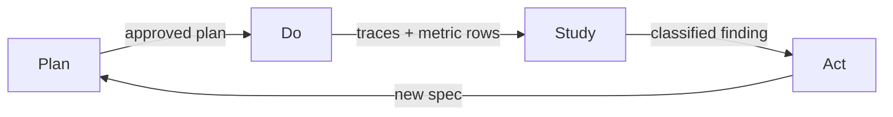

Your agents ship work every day, but no one can say whether the team is getting
better. The only feedback loop you have is to read every diff, and that stops
working in the first week. Kata replaces it with a daily Plan-Do-Study-Act
cycle. The team plans from an approved spec, ships the plan, studies its own
traces, and acts on what it finds.

This guide walks through the whole cycle once. You put the roster in shift
order, give the team one place to keep memory, and then follow the work through
Plan, Do, Study, and Act. At the end, the loop runs without you, and it leaves
evidence of what improved.

## Prerequisites

- A repository with GitHub Actions enabled and the repository wiki enabled
- `apm install forwardimpact/kata-skills` and
  `apm install forwardimpact/gemba-skills`
- The shift, storyboard, and dispatch workflows generated, with one green run
- One agent profile per role under `.claude/agents/`
- An `ANTHROPIC_API_KEY` secret, and a GitHub App the workflows authenticate as

[Getting Started: Your First Kata Shift](/docs/getting-started/) sets these up.
Kata has no CLI of its own. It runs on the Gemba platform, and the workflows
call the [Gemba commands](https://www.gemba.team/) for sessions, memory,
traces, and metrics.

## The four phases and their handoffs

Every workflow belongs to exactly one phase, and each phase hands a specific
artifact to the next one. That handoff turns the cycle into a loop. Without it,
each phase produces a report and stops.


```mermaid
graph LR
    P["Plan"] -->|"approved plan"| D["Do"]
    D -->|"traces + metric rows"| S["Study"]
    S -->|"classified finding"| A["Act"]
    A -->|"new spec"| P
```

| Phase | What enters | What the phase produces |
| --- | --- | --- |
| **Plan** | a spec a human already approved | a design, then an executable plan |
| **Do** | an approved plan, plus standing maintenance work | implementation PRs, releases, and one trace per run |
| **Study** | traces, PRs, issues, docs, and metric rows from Do | findings, each grounded in quoted evidence |
| **Act** | one finding at a time | a pushed fix PR, a pushed spec branch, or a Discussion |

The middle column shows what a phase needs as input. The right column shows
what you can expect back. If a phase produced none of the items in its row, it
did not run.

## Decide these before the first unattended cycle

- **Which roles run, and in what order.** One workflow runs the whole roster,
  one agent at a time. The order in the workflow decides which agents see the
  output of the agents that ran before them.
- **What each role must not do.** Every profile has explicit scope
  constraints. An agent with no stated scope acts on anything it notices, and a
  documentation review can turn into a library refactor.
- **Who counts as a trusted human.** Approvals come from people you list. The
  optional `.kata/settings.json` file selects the trust source and how
  thorough the reviews are.
- **When the shifts start.** The templates schedule a night, a day, and a swing
  shift in your timezone. The storyboard runs after the night shift finishes.
- **Whether the team keeps memory.** With the wiki on, agents keep state
  across sessions. Without it, every run starts from nothing.

## Step 1: Put the roster in shift order

The shift workflow runs the roster in series, one agent per matrix entry, with
a parallelism of one. Order the entries as a chain: triage first, then
engineering, then the security and documentation reviews of what engineering
produced, then shipping after the reviews pass. The coach runs last, because it
assesses the shift that has just finished.

The serial order protects the shared state, because the agents share one
checkout and one memory. If two agents write the same file in the same minute,
you get a merge conflict, and neither run says which change the team intended.

Each agent selects its own work at boot. It reads its own priorities first,
then its storyboard deliverables, then its domain checks, and then the
cross-cutting work that lists it. It takes the first level that has real work.
You do not need to write a prompt for each shift.

When a finding is outside an agent's scope, the agent writes it up and leaves
it for the owner. This rule stops a small correction from growing into an
unreviewed architecture change.

[Choose and Scope Your Agent Roster](/docs/continuous-improvement/agent-roster/)
covers which roles to enable first and how to write a scope constraint that
works. A profile is an instruction layer, and
[Jidoka](https://www.jidoka.team/docs/layered-instructions/) has the rules for
writing one.

## Step 2: Give the team one place to remember

Memory is stored in the repository wiki as markdown files in a separate
checkout. Every surface reads the same files, so a scheduled shift, a reply on
a pull request, and an interactive session in your editor all share one state.

Each agent reads a small set of files at boot: its own summary, the
cross-cutting memory, and the current storyboard. During the run, it appends its
decisions to its append-only weekly log. At the end of the run, it updates its
summary to the current state.

Memory records what an agent knows. Coordination is a request to a specific
receiver on an artifact that receiver opens: an issue, a pull request comment,
a Discussion, or a dispatched run. If an agent writes a request in its own
summary, no other agent reads it.

Before an agent writes any code, it claims the target it works on. The claim
row lists the agent, the target, the branch, and an expiry date. A missing
claim is the most common cause of duplicated work.

[Keep Team Memory and Coordination Apart](/docs/continuous-improvement/team-memory/)
covers the boot read set, the claim gate, and the coordination channels.
[Gemba wiki operations](https://www.gemba.team/docs/predictable-team/wiki-operations/)
documents the commands.

## Step 3: Plan turns an approved spec into an executable plan

Plan starts from a spec that a trusted human approved. The approval record is
`wiki/STATUS.md`, a tab-separated file with one row per spec that holds the id,
the phase, and the status. Agents never approve a spec or a design themselves.
They only record a signal that a human gave.

Plan produces two artifacts in sequence:

- A **design** answers WHICH and WHERE. It sketches the components, interfaces,
  data flow, and the decisions with their trade-offs. It is kept short so that
  a reviewer can read it once and change the architecture early.
- A **plan** answers HOW and WHEN. It lists the steps, files, sequence, and
  risks in a form that a trusted agent can execute without further
  interpretation.

The spec, the design, and the plan are stored together in one directory per
spec, so you can read the whole history of a change from top to bottom. A
review panel reads each artifact before the push, and each artifact waits for
its own approval row.

The two documents give you two early points to change direction. A change to a
design costs a few lines. A change to an implementation can cost a week of
work.

[Take a Change from Spec to Shipped](/docs/spec-to-shipped/) covers the full
sequence.
[Set the Approval Gates and Trust Boundary](/docs/spec-to-shipped/approval-gates/)
covers who may approve what.

## Step 4: Do ships the plan and leaves evidence

Do carries out approved plans through implementation pull requests. It also
runs the standing work that keeps a repository ready to ship: dependency
patches, branch repair, and release cuts. Standing work includes the replies
that your dispatch workflow sends on issue and pull request events.

Every run records a trace of what the agent read, what it tried, what it
spent, and where it stopped. Traces are the raw material that Study reads. A
team that discards them has only impressions to discuss.

End-to-end skills also append one metric row per run. A row holds the counts
that the skill owns plus the identifier of the workflow run that wrote it. This
means that you can trace a suspicious point on a chart to a specific run, with
no search through a time window.

One merge point stays under human control. A single role merges external
contributions, and it merges only what the approval record already authorized.

## Step 5: Study reads the evidence, one topic deep

Study analyzes what Do produced. It runs as separate streams, and each stream
makes one pass:

- A security review of dependencies, the supply chain, and credential controls.
- Triage of external issues and pull requests against the product vision.
- A documentation review that covers one topic in depth per run.
- A grounded-theory analysis of one trace. For a question about the team
  itself, the analysis widens to the whole change history.

Each run covers one topic, because a sweep across everything produces a long
list that no one acts on. A single topic produces findings that are small
enough to fix.

Every finding cites its evidence: a trace line, a diff, an issue, or a metric
row. Without evidence, the next shift cannot check a finding and may reject
it.
[Trace analysis](https://www.gemba.team/docs/prove-changes/trace-analysis/)
covers how to query a trace for the evidence that a finding needs.

## Step 6: Act gives every finding a URL

Teams often skip Act, and then the improvement program becomes a reporting
habit. Each finding takes one route:

- **Mechanical.** The fix is clear and bounded. It does not replace
  architecture, add a component or a contract, or cross a scope boundary. It
  becomes a fix branch and a pushed pull request.
- **Structural.** The finding needs a design decision, changes a component or
  a contract, or is outside the scope of the agent that found it. It becomes a
  spec on its own branch, and it enters Plan on the next cycle.
- **Unsettled.** No one has decided the answer yet, the same question reached
  two agents, or the change affects a shared rule. It becomes a Discussion
  first, and the Discussion ends in a spec, a memory note, or a close.
- **Out of scope.** Record the decision and stop. This route creates no branch
  and no issue.

A tie-breaker settles a finding that fits neither route. If you cannot
describe the change as a single verifiable diff without a design decision
first, the finding is structural.

Fix branches and spec branches never mix, so a dependency bump never arrives
together with a new component. A local commit does not complete a finding,
because a finding is done only when it has a URL.

[Turn Study Findings into Fixes and Specs](/docs/continuous-improvement/findings-to-action/)
covers the classification tests and the routing for each work type.

## Step 7: Close the day at the storyboard

Once a day, the coach runs a storyboard session with the roster. It asks the
coaching kata questions: where the team is headed, where it stands now, and
what blocks it. The last two questions ask for the next step and for when the
team will see the result.

The session has one strict rule. The current condition comes from measured
numbers in the metric files, not from a description. A report such as "the
docs feel better" does not count.

Each participant identifies an obstacle in its own domain and proposes one
experiment against it, and it records the expected outcome before the run.
Both become labeled issues. Those issues then appear in that agent's boot
routing as storyboard deliverables, so the next shift picks up the experiment
without a prompt from you, and the loop closes.

[Run the Daily Storyboard and Coaching Session](/docs/continuous-improvement/daily-storyboard/)
covers the facilitation, the participant protocol, and the one-on-one variant.

## The artifacts the loop writes

| Artifact | Written by | Holds |
| --- | --- | --- |
| `.claude/agents/<role>.md` | you | persona, scope constraints, skill composition |
| `.kata/settings.json` (optional) | you | trust source and review rigor |
| the spec, design, and plan files | Plan agents | one directory per change |
| `wiki/STATUS.md` | the dispatcher, from human signals | the approval record, one row per spec |
| `wiki/MEMORY.md` | curation and the claim gate | cross-cutting priorities and active claims |
| `wiki/<role>.md` | each agent at run end | current state, inbox, open blockers |
| `wiki/<role>-<year>-W<week>.md` | each agent during a run | append-only decisions and actions |
| `wiki/storyboard-<year>-M<month>.md` | the coach | current condition, obstacles, experiments |
| `wiki/metrics/<skill>/<year>.csv` | each end-to-end skill | one row per run |

## Read the metrics as signal

The storyboard reads the metric files as XmR control charts, which separate a
real change from routine variation. A new metric reports insufficient data
until enough runs have accumulated. Control limits need a baseline, and a chart
drawn from three points misleads you, so wait for the baseline.

Once the limits exist, only a fired rule counts as a change. Every other
movement is noise, and a team that acts on noise tampers with a process that was
working. Choose metrics that a single skill owns, because a prediction cannot
span the runs of two skills.
[XmR analysis](https://www.gemba.team/docs/predictable-team/xmr-analysis/)
covers the rules and the chart output.

## Stop the whole team at once

Every Kata workflow checks one repository variable, `KATA_KILLSWITCH`, as its
first step, before it gets a token or checks out code. A truthy value stops
scheduled shifts, event-driven replies, and manual runs together. A truthy
value is anything other than empty, `0`, `false`, `no`, or `off`.

Set it under Settings, then Secrets and variables, then Actions, then
Variables. Write a falsy value to resume. Deleting the variable also resumes
the team, but it leaves no record of who cleared it or when. You do not need to
disable workflows one at a time, and you keep the schedule you configured.

## Failure modes that stall the loop

| Symptom | Cause | Fix |
| --- | --- | --- |
| Study produces a long report and nothing changes | no one classified the findings | route every finding through Act, and treat a finding with no URL as unfinished |
| The same finding returns three shifts in a row | the earlier runs left local commits | push the branch and open the pull request in the same run |
| One pull request contains a dependency bump and a new component | fix and spec work shared one branch | split it, and keep the two branch families apart |
| Two agents build the same thing | no claim row existed before the first code change | claim the target, push the claim, then start |
| The storyboard reports impressions | no skill recorded metric rows | make the skill record its run before it reports |
| A small review turned into a refactor | the profile had no scope constraint | state what the role must not do, so that it writes a spec instead |

## Verify

Run these checks after your first full day. Each one looks at a handoff
between two phases.

1. **Every role ran and chose work.** The shift run shows one job per role,
   and each agent's memory records the decision it made.

   ```sh
   npx gemba-wiki boot --agent <role>
   ```

   Expected: a digest that lists the priorities, storyboard items, and claims
   that the agent saw.

2. **Memory passes its own audit.**

   ```sh
   npx gemba-wiki audit
   ```

   Expected: no findings. A finding shows the file and the rule it broke.

3. **Every Study finding reached Act.** Read the weekly log entries from the
   last shift. Each finding links to a pull request, an issue, or a Discussion.

4. **Branch families stayed apart.**

   ```sh
   gh pr list --state open --json headRefName,title
   ```

   Expected: every branch belongs to one family, and no pull request contains
   both a fix and a new spec.

5. **The approval record matches the repository.** Open `wiki/STATUS.md`.
   Every spec with merged work has a row at the phase that the work belongs
   to.

6. **Experiments exist for the next cycle.**

   ```sh
   gh issue list --label experiment --state open
   ```

   Expected: one open experiment per role that reported at the storyboard, each
   labeled with that role.

## What's next

<div class="grid">

<!-- part:card:agent-roster -->
<!-- part:card:team-memory -->
<!-- part:card:findings-to-action -->
<!-- part:card:daily-storyboard -->
<!-- part:card:../spec-to-shipped -->

</div>
