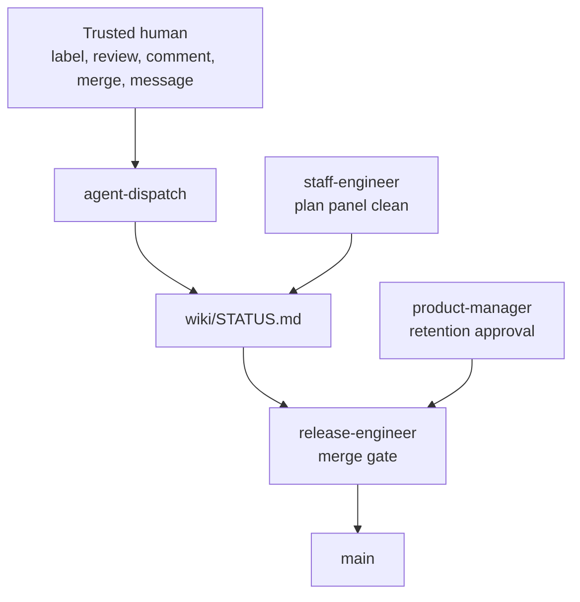

Your agents now carry a change from spec to shipped. Somebody must still decide
that the specification is right and that the pull request may land on `main`.
Kata gives you one state file and one merge point for both decisions. This guide
sets that boundary, follows the approval signal into the file, and shows how to
move the boundary later. It assumes you already run the
[spec to shipped](/docs/spec-to-shipped/) workflow.

## Prerequisites

- A Kata install that runs the dispatch and shift workflows. See
  [Getting Started](/docs/getting-started/).
- A wiki that holds `STATUS.md`. The agents read and write it through
  `gemba-wiki`. See
  [Set Up Persistent Memory and Metrics](https://www.gemba.team/docs/predictable-team/)
  on the Gemba site.
- Write access to your repository's Actions variables.

## Decide three things first

1. **Who is a trusted human.** The gate blocks every author outside that set.
2. **Which approvals a human must give.** Specification and design approval are
   human-only by default. Plan approval is the one you can delegate.
3. **How hard the review panels work.** A wider panel and a lower severity
   floor catch more and cost time.

## The boundary in one picture



A trusted human acts on the change. The dispatch workflow validates the actor
and writes the state. The merge gate reads it. The release engineer is the only
agent that merges an external change, so one checkpoint covers every path.

## Gates a human holds

| Case | Why a human holds it |
| --- | --- |
| `spec approved` | The change defines what the team builds and why. |
| `design approved` | The change fixes the architecture other work sits on. |
| A diff that touches `.kata/` | The diff changes the trust policy itself. |
| An external change that is not a fix or a specification | The gate merges no other type from outside the team. |

Agents never originate a specification approval or a design approval. An agent
only carries forward a signal a trusted human already gave, and a human who
merges a change gave such a signal. The `.kata/` rule closes the obvious hole.
Without it, an untrusted author could widen the trusted set inside the same pull
request that the widened set would let through. The gate also reads the settings
from the default branch, so a branch cannot grant itself trust.

## Gates an agent may hold

| Case | Which agent | Condition |
| --- | --- | --- |
| `plan approved` | staff-engineer | The review panel came back clean. |
| A retention change | product-manager | Every target is terminal and its durable signal survives elsewhere. |

Both delegations stay narrow. A plan describes how to execute an approved
design, so a bad plan costs a rewrite. A merge performed by an agent is never an
approval. The gate merges only what the state file already authorized.

## How the signal reaches STATUS

`wiki/STATUS.md` is the canonical record. The file wraps a tab-separated body
in a fenced code block. One row holds one specification.

```text
2140	spec	approved
2141	design	draft
```

Phases are `spec`, `design`, and `plan`. Statuses are `draft`, `approved`,
`implemented` for a plan row, and `cancelled`. A row moves forward through
`spec draft`, `spec approved`, `design draft`, `design approved`, `plan draft`,
`plan approved`, and `plan implemented`. Replace a row in place, never append.

These signals write a row.

| Signal | Who may give it | What records it |
| --- | --- | --- |
| A `<phase>:approved` label on the change | Trusted human | The dispatch workflow, on the label event |
| An approving review | Trusted human account | The dispatch workflow, on the review event |
| A comment that approves, such as "LGTM" or "ship it" | Trusted contributor | The dispatch workflow, on the comment event |
| The human merges the change | Trusted human. The merge is the approval | The dispatch workflow, on the close event |
| A message in an interactive session | Trusted user | The agent in that session |
| A clean plan review panel | staff-engineer, plans only | The plan skill |
| A retention approval | product-manager, retention changes only | The merge gate, with no row written |

The retention case is the one approval the state file does not mediate. A
retention change carries no specification identifier, so the gate reads the
approving review at merge time. An in-session approval needs no GitHub action.
The agent writes the row, commits the wiki, and the stop hook pushes it. The
merge happens on the next gate run.

## Keep the approval pinned to a head

Every approval certifies the exact content it was given on, and the agents
record the head revision with the approval. When the head moves after that, the
approval stops covering the change and the gate blocks it again. A rebase counts
as a move. So does a formatting fix the gate applies itself. Two exceptions keep
this workable. A move that leaves every touched path byte-identical permits a
recorded re-verification. A merged change needs no pin, because a closed head
cannot move.

So sequence the work. Let the gate finish its rebase and its mechanical fixes,
then approve. An approval given before that work lands buys you nothing.

## Tighten or loosen the boundary

`.kata/settings.json` at your repository root holds the policy. The file is one
flat JSON object with no nesting. An absent file and an absent key both select
the marked default, so a fresh install runs with no file at all.

```json
{
  "trustSource": "allowlist",
  "trustAllowlist": ["ada", "grace"],
  "reviewPanel": "thorough",
  "reviewBlockingSeverity": "high"
}
```

| Key | Effect |
| --- | --- |
| `trustSource` | `top-contributors` trusts the repository's leading human contributors. `allowlist` trusts exactly the logins you name. |
| `trustContributorCount` | How many contributors `top-contributors` trusts. Humans only. |
| `trustAllowlist` | The logins `allowlist` trusts. An empty list trusts no human. |
| `reviewPanel` | Panel width for specification, design, plan, and implementation reviews. `light`, `standard`, or `thorough`. |
| `reviewBlockingSeverity` | The floor a finding must reach to block. `blocker`, `high`, `medium`, or `low`. |

Choose `allowlist` when you adopt Kata on a repository with a long history.
Contributor ranking counts every past author, and some of them left years ago.
Move to `top-contributors` once the ranking matches your team. The CI app
identity stays trusted under every source, so the team's own work keeps flowing.

A misconfiguration degrades in two ways. A skill outside the merge gate falls
back to the default and reports the problem on the change it works on. The merge
gate fails closed. It blocks every trust-gated merge with the reason
`settings unreadable`. Expect a quiet repository after a bad edit.

## Stop everything at once

Set the `KATA_KILLSWITCH` Actions variable to any truthy value. Every Kata
workflow checks it first and fails fast, so scheduled shifts, the event
dispatcher, and manual runs stop together. Clear the variable to resume. Use it
when an agent behaves wrongly and you do not yet know which gate let it through.

## The failure you will hit

The common failure is a silent state file. A human merges a specification change
from the GitHub UI and nobody writes the row. The trunk now holds an approved
specification while the row still reads `spec draft`. Every later phase stalls,
because the gate reads the row and not the trunk.

Fix it by reconciling that one row to what the human merged. A merged
specification change writes `spec approved`. A merged design change writes
`design approved`. A merged implementation change writes `plan implemented`.
Reconciliation records what happened. It never advances a later phase.

The second failure comes from an empty allowlist. `trustAllowlist: []` trusts no
human, so every external change blocks with a trust reason.

## Verify

```sh
git show origin/main:.kata/settings.json
```

The gate reads this exact copy. Compare it against your working tree when a
policy change seems to have no effect. Then confirm each check below.

- The `STATUS.md` row for the specification shows the phase you approved.
- The gate's comment on a blocked change names the gate that stopped it.
- A change from an untrusted author blocks with a trust reason.
- A change that touches `.kata/` blocks until a human approves the current head.

## What's next

<div class="grid">

<!-- part:card:.. -->
<!-- part:card:../../continuous-improvement -->
<!-- part:card:../../continuous-improvement/agent-roster -->
<!-- part:card:../../continuous-improvement/team-memory -->
<!-- part:card:../../getting-started -->

</div>
