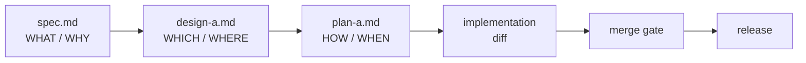

An agent opens a pull request with two thousand changed lines. The code runs.
The tests pass. Nobody agreed to the shape of it. The reviewer now argues
architecture inside a diff, the most expensive place to argue it.

Kata splits a change into phases so that each decision gets challenged at the
cheapest moment. A spec settles the problem before anyone picks components. A
design settles the components before anyone lists file edits. A plan settles the
sequence before anyone writes code. This guide walks one change through that arc
in your own repository. It names the artifact each phase produces, the content
that belongs in it, and the failure you get when content lands in the wrong
phase.

## Prerequisites

- [Getting Started: Your First Kata Shift](/docs/getting-started/) is complete.
  You installed the pack with `apm install forwardimpact/kata-skills`, and your
  agent profiles exist under `.claude/agents/`.
- A wiki checkout holds `wiki/STATUS.md`. Gemba ships the commands that create
  and sync it. See
  [Wiki operations](https://www.gemba.team/docs/predictable-team/wiki-operations/).
- Your approval gates are set. Decide who counts as a trusted human before the
  first spec lands. See
  [Set the Approval Gates and Trust Boundary](/docs/spec-to-shipped/approval-gates/).

## One question per phase

Every phase answers exactly one question. An artifact that answers the next
phase's question is a defect, and the review panel treats it as one.

| Phase     | Question       | Artifact             | Skill               |
| --------- | -------------- | -------------------- | ------------------- |
| Spec      | WHAT and WHY   | `spec.md`            | `kata-spec`         |
| Design    | WHICH and WHERE| `design-a.md`        | `kata-design`       |
| Plan      | HOW and WHEN   | `plan-a.md`          | `kata-plan`         |
| Implement | the diff       | branch and pull request | `kata-implement` |
| Review    | findings only  | a severity-graded list | `kata-review`     |
| Merge     | may this land  | the merge itself     | `kata-release-merge`|
| Release   | is it published| tags and packages    | `kata-release-cut`  |



Every arrow crosses the default branch, and a review panel grades each artifact
before it gets there. The spec pull request merges before the design starts, and
the design merges before the plan starts. That order gives a trusted human three
real stopping points, and each stop costs one artifact instead of one diff. The
`staff-engineer` profile owns the arc up to implementation, and the
`release-engineer` profile owns the merge gate and the release. Keep those roles
apart. The agent that writes code must not decide that the code may land.

## The artifact tree

All phase artifacts for one change live in one directory:

```text
specs/{NNN}-{kebab-case-slug}/
  spec.md         WHAT and WHY
  design-a.md     WHICH and WHERE
  plan-a.md       HOW and WHEN
  plan-a-01.md    optional part of a decomposed plan
```

The letter suffix stays even when only one design exists. A second approach
becomes `design-b.md`, and implementation takes variant `a` unless the approver
selects another one.

## Claim the number before you write

The spec phase starts with a claim. The agent reads `wiki/STATUS.md`, picks the
next free id, and appends a draft row:

```text
{NNN}<TAB>spec<TAB>draft
```

STATUS is a tab-separated file with one row per change. The cells hold the id,
the phase, and the status. Statuses run `draft`, `approved`, `implemented` for a
plan row, and `cancelled`. The agent commits and pushes the wiki at once, so a
parallel session sees the claim. An abandoned change moves to `cancelled`, and
nobody ever deletes a row.

**Failure if you skip the claim.** Two shifts write a spec on the same morning
and pick the same id. Both pull requests then target the same STATUS row, and
the gate cannot tell which change that row authorizes.

## Write the spec (WHAT and WHY)

Ask your agent for the spec and nothing else:

```sh
echo "Write a spec: shift traces drop per-run cost" | claude
```

The skill never advances to a plan on its own, so one prompt yields one
artifact. A good spec carries these parts:

- **The problem, with evidence first.** Errors, metrics, and examples come
  before the proposal. A reader who disagrees with the evidence stops here, at
  the cheapest stop in the arc.
- **Specific scope.** Name the affected entities and behaviours. State what the
  change excludes. An unstated exclusion becomes scope creep in the diff.
- **A compatibility stance.** One line. A clean break is the default. When the
  change must keep an old path alive, the spec says so and says why. A break
  makes removal of the old path a success criterion.
- **Verifiable success criteria.** Each criterion is one claim plus the command
  that proves it. One sentence each. No rationale.
- **A classification.** Product-aligned when the change lands on a shipped
  surface someone hires, or documents one. Internal for everything else: shared
  libraries, agent configuration, continuous integration, and release tooling.
  This line decides the label the pull request carries later. The tree that
  grounds the test lives in the repository structure standard at
  [monorepo.team](https://www.monorepo.team/).

Keep implementation out of a spec. That means no file paths, no function
signatures, no tool selection, and no sequence. A spec names what a component
does, and the design names the mechanism. Approval of a spec is a human
decision. Your agents propagate a human's signal into STATUS, and they never
originate `spec approved` on their own.

**Failure if the spec carries HOW.** The design phase has nothing left to
decide, so it rubber-stamps the mechanism the spec smuggled in.

## Sketch the design (WHICH and WHERE)

The design phase starts only after `spec.md` exists on the default branch, and
`kata-design` stops when the file is absent.

A design answers which components exist, where they interact, and what
interfaces connect them. `kata-design` holds it to 200 lines, and that cap is
the point of the phase. A short document invites a reviewer to redirect the
architecture. A long one invites a skim.

A good design carries these parts:

- **Components, interfaces, and data flow.** Nothing at file level, and nothing
  about execution order. Those belong in the plan.
- **Decisions with trade-offs.** Every architectural choice names at least one
  rejected alternative and the reason for the rejection. A choice with no
  rejected alternative is not yet a decision.
- **A diagram where a diagram reads faster than a paragraph.** Component
  relationships, data flow, and state machines all render well. Record each
  decision in one home only, because a duplicated decision drifts.
- **A clean break.** The design names what it removes. A replacement that
  deletes nothing is incomplete.

When the architecture does not fit in the cap, narrow the spec. Never split the
design into parts. An over-long design tells you the change carries more than
one commitment.

**Failure if you exceed the cap.** The review panel returns a blocker on line
count alone, and the phase restarts.

## Write the plan (HOW and WHEN)

The plan phase starts only after `design-a.md` exists on the default branch. A
plan translates the design into steps a trusted agent executes without a re-read
of the upstream artifacts.

Each step is one heading plus four things:

1. One sentence of intent.
2. A file list, split into created, modified, and deleted.
3. The concrete change as a code block, a table, or a bullet list.
4. One line of verification.

The plan also carries a one-paragraph approach, a line that names the libraries
the change uses, the risks the implementer cannot see from the steps, and an
execution recommendation. Route code to an engineering profile and documentation
to the `technical-writer` profile.

Decompose a large plan into `plan-a.md` plus numbered parts. The overview holds
the strategy, the cross-cutting concerns, and the part index. Each part runs
independently and states its dependencies.

Write no per-step rationale, because rationale lives in the design. Restate
nothing from the spec, because the implementer reads both.

**Failure if the plan restates the spec.** The implementing agent fills its
context with prose it already has, and it runs out of room for the code it must
read. It then starts to summarize the plan instead of executing it.

**Failure if a removal never reaches a deleted list.** The clean break the
design promised turns into follow-up work that nobody schedules. The old path
survives, and the next change has two paths to reason about.

A plan is the one phase an agent may approve. The `staff-engineer` profile
writes `plan approved` after a clean panel. Specs and designs stay human-only.
[Set the Approval Gates and Trust Boundary](/docs/spec-to-shipped/approval-gates/)
holds the full signal table.

## Run the independent review panel

Every phase ends with the same move. The authoring agent spawns fresh
sub-agents, and each one loads `kata-review` and grades the artifact cold. The
panel has these properties, and each one stops a specific failure:

- **Cold context.** A reviewer inherits no reasoning, so it reads what the
  artifact says.
- **One identical prompt per panel.** Every reviewer in a panel receives the
  same artifact type, the same paths, and the same upstream documents.
- **Parallel launch, no shared scratchpad.** All reviewers launch in one
  message, and no reviewer sees another reviewer's output. Cross-feeding
  collapses the panel back to one opinion and keeps correlated errors alive.
- **A leaf in the call graph.** `kata-review` has no step that spawns a
  sub-agent, and it never invokes the authoring skill. That structure prevents
  an infinite review loop.

Reviewers grade every finding with one severity:

| Severity | Meaning                                                        |
| -------- | -------------------------------------------------------------- |
| Blocker  | The work is broken, dangerous, or materially wrong.            |
| High     | A correctness or clarity problem that causes rework downstream.|
| Medium   | A real quality issue, worth a fix while the context is fresh.  |
| Low      | A nit or a preference.                                         |

The caller merges findings inside each panel. It groups findings that cite the
same location and raise the same concern, counts the votes, and picks the
severity by mode. A finding that a majority of the panel raises carries
consensus. The caller then verifies every finding against the artifact, fixes
everything at or above your blocking severity, and records a one-line rationale
for anything it dismisses. The caller stays accountable for the outcome. Run the
panel before the push, and re-run it after a substantial fix.

On a diff the panel checks a fixed list. The diff meets every success criterion
in the spec. The old path is gone, with no shim the spec did not require.
Nothing outside the plan appears. The commits are atomic. Input validation,
secret handling, and shell calls carry no regression.

## Implement the plan

Implementation starts only after `plan-a.md` exists on the default branch. The
implementing agent works through the plan step by step:

1. **Isolate the work.** Enter a fresh worktree. Never implement on the primary
   working tree, because a scheduled shift may run in the same checkout.
2. **Claim before the first write.** Record the claim in shared memory, then
   probe the remote and the open changes for the same target. See
   [Keep Team Memory and Coordination Apart](/docs/continuous-improvement/team-memory/).
3. **Read the spec and every plan file in full** before the first line of code.
4. **Verify the plan's assumptions.** Confirm the files still exist and the
   signatures still match. Adapt to stale assumptions, and say so in the commit
   message.
5. **Implement only what the plan describes.** No extra refactor, no extra
   feature, and no cleanup. Scope creep in a diff is a review finding.
6. **Verify after each logical group.** Run the checks and tests as you go.
   Untested work that accumulates hides which step broke.
7. **Commit atomically.** One logical change per commit, with a conventional
   `type(scope): subject` subject line.
8. **Run the panel on the diff.** Address the confirmed findings, then push.
9. **Open the pull request.** Carry the change id in the title, for example
   `feat(scope): subject (#NNN)`. Announce it on the coordinating issue.

When a plan step targets your agent instructions under `.claude/`, follow the
layer rules at
[jidoka.team](https://www.jidoka.team/docs/layered-instructions/).

## Take the change through the merge gate

One agent merges. The `release-engineer` profile runs `kata-release-merge`
against every open pull request and checks each of these in order:

- **Trust.** The author is your app identity, or a member of the trusted set
  your settings resolve. Unreadable settings fail closed.
- **Type.** The title prefix names the phase. An unknown prefix blocks.
- **Checks.** Every check passes, after safe mechanical repair.
- **Mechanical readiness.** A behind or conflicted branch rebases on the default
  branch. A lock file, a generated file, and a formatting conflict are all
  mechanical. A conflict in logic is substantive, so the gate reports it
  instead.
- **Approval.** The STATUS row shows the classified phase at `approved`, and the
  signal verifiably covers the current head.
- **Open comments.** No trusted human's concern sits unresolved at the tail.
- **Classification label.** The pull request carries `product` or `internal`.

The prefix decides which row the gate reads:

| Title prefix                            | Phase          | STATUS row it reads |
| --------------------------------------- | -------------- | ------------------- |
| `spec`                                  | spec           | `{NNN}` at `spec approved` |
| `design`                                | design         | `{NNN}` at `design approved` |
| `plan`                                  | plan           | `{NNN}` at `plan approved` |
| `feat`, `fix`, `bug`, `refactor`, `chore`| implementation | `{NNN}` at `plan approved`, then written to `plan implemented` |
| `docs`                                  | documentation  | none, on a trust-only fast path |

The documentation fast path applies only when every changed file is markdown,
and it skips the approval row alone. Every pull request still needs the
classification label.

**Failure if a rebase follows an approval.** An approval signal pins to the head
it approved. Any change to that head voids the pin, including a rebase the gate
performs itself. The gate then blocks until a fresh signal covers the new head.
Land approvals on a branch that is already current.

**Failure if the label is absent.** The gate blocks and waits for a human. Apply
the label at open time, taken straight from the spec's classification line.

At an implementation merge the gate writes the terminal row,
`{NNN} plan implemented`. That row records completion only. An agent merge is
never an approval signal.

## Cut the release

A merged change reaches users only after a release. The `release-engineer`
profile runs `kata-release-cut`:

1. **Pre-flight.** Confirm the recent default-branch runs succeeded. Repair a
   trivial failure, then confirm again. Never release from a broken branch.
2. **Enumerate.** For each package, compare the latest release tag against the
   default branch and list the commits that touch that package. Skip a package
   with no unreleased commit.
3. **Choose the bump.** Below version 1.0, any change is a patch. From 1.0
   onward, a breaking change is a major bump, a feature is a minor bump, and
   everything else is a patch.
4. **Bump, install, verify.** Update the version, refresh the lock file, then
   run the repository checks. A major bump also updates its dependents.
5. **Tag.** One tag per package, in the form `{prefix}@v{version}`.
6. **Push one tag at a time.** A single push per tag keeps one publish workflow
   per tag, so a failure names its own package.
7. **Verify the publish.** Confirm the publish workflow for each tag finished
   green and the artifact is live.

Release a producer before its consumers. The gate blocks a pull request that
pins a consumer to an unpublished version, and that block holds until the
producer is out.

## Verify

The arc works in your repository when all of these hold:

- `wiki/STATUS.md` holds one row per change, and every row matches the default
  branch.
- A spec directory holds the artifacts of one change only.
- Each phase pull request merged before the next phase started.
- Every artifact pull request shows a panel record, and every confirmed finding
  at or above your blocking severity has a fix or a written dismissal.
- One agent merged every change, and no agent approved a spec or a design.
- Every tag matches `{prefix}@v{version}` and has a green publish run.

## What's next

<div class="grid">

<!-- part:card:approval-gates -->
<!-- part:card:../continuous-improvement -->
<!-- part:card:../continuous-improvement/findings-to-action -->
<!-- part:card:../continuous-improvement/team-memory -->
<!-- part:card:../getting-started -->

</div>
