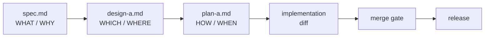

An agent opens a pull request with two thousand changed lines. The code runs
and the tests pass, but no one agreed to the shape of the change. The reviewer
now has to argue about architecture inside a diff, and a diff is the most
expensive place for that argument.

Kata splits a change into phases so that reviewers can challenge each decision
at the cheapest point. A spec settles the problem before anyone chooses
components, and a design settles the components before anyone lists file
edits. A plan then settles the sequence before anyone writes code.

This guide takes one change through that sequence in your own repository. It
describes the artifact that each phase produces and the content that belongs
in it. It also describes what goes wrong when content ends up in the wrong
phase.

## Prerequisites

- [Getting Started: Your First Kata Shift](/docs/getting-started/) is complete.
  You installed the pack with `apm install forwardimpact/kata-skills`, and your
  agent profiles exist under `.claude/agents/`.
- A wiki checkout holds `wiki/STATUS.md`. Gemba ships the commands that create
  and sync it. See
  [Wiki operations](https://www.gemba.team/docs/predictable-team/wiki-operations/).
- You have set your approval gates. Decide who counts as a trusted human before
  the first spec arrives. See
  [Set the Approval Gates and Trust Boundary](/docs/spec-to-shipped/approval-gates/).

## One question per phase

Every phase answers exactly one question. An artifact that answers the next
phase's question is a defect, and the review panel treats it as one.

| Phase     | Question       | Artifact             | Skill               |
| --------- | -------------- | -------------------- | ------------------- |
| Spec      | WHAT and WHY   | `spec.md`            | `kata-spec`         |
| Design    | WHICH and WHERE| `design-a.md`        | `kata-design`       |
| Plan      | HOW and WHEN   | `plan-a.md`          | `kata-plan`         |
| Implement | the diff       | branch and pull request | `kata-implement` |
| Review    | findings only  | a severity-graded list | `kata-review`     |
| Merge     | may this land  | the merge itself     | `kata-release-merge`|
| Release   | is it published| tags and packages    | `kata-release-cut`  |


```mermaid
graph LR
    S["spec.md<br/>WHAT / WHY"] --> D["design-a.md<br/>WHICH / WHERE"]
    D --> P["plan-a.md<br/>HOW / WHEN"]
    P --> I["implementation<br/>diff"]
    I --> G["merge gate"] --> R["release"]
```

Every arrow crosses the default branch, and a review panel grades each artifact
before it gets there. The spec pull request merges before the design starts,
and the design merges before the plan starts. That order gives a trusted human
three real stopping points, and each stop costs one document instead of one
diff. The `staff-engineer` profile owns the sequence up to implementation, and
the `release-engineer` profile owns the merge gate and the release. Keep those
roles separate, because the agent that writes code must not decide that the
code may merge.

## The artifact tree

All phase artifacts for one change live in one directory:

```text
specs/{NNN}-{kebab-case-slug}/
  spec.md         WHAT and WHY
  design-a.md     WHICH and WHERE
  plan-a.md       HOW and WHEN
  plan-a-01.md    optional part of a decomposed plan
```

The letter suffix stays even when only one design exists. A second approach
becomes `design-b.md`, and implementation takes variant `a` unless the approver
selects another one.

## Claim the number before you write

The spec phase starts with a claim. The agent reads `wiki/STATUS.md`, picks the
next free id, and appends a draft row:

```text
{NNN}<TAB>spec<TAB>draft
```

STATUS is a tab-separated file with one row per change, and the cells hold the
id, the phase, and the status. Valid statuses are `draft`, `approved`,
`implemented` for a plan row, and `cancelled`. The agent commits and pushes
the wiki at once,
so that a parallel session sees the claim. An abandoned change moves to
`cancelled`, and no one ever deletes a row.

**If you skip the claim.** Two shifts write a spec on the same morning and
pick the same id. Both pull requests then target the same STATUS row, and the
gate cannot tell which change that row authorizes.

## Write the spec (WHAT and WHY)

Ask your agent for the spec and nothing else:

```sh
echo "Write a spec: shift traces drop per-run cost" | claude
```

The skill never continues to a plan on its own, so one prompt produces one
artifact. A good spec has these parts:

- **The problem, with the evidence first.** Errors, metrics, and examples come
  before the proposal. A reader who disagrees with the evidence stops here, and
  this is the cheapest stop in the sequence.
- **A specific scope.** List the affected entities and behaviours, and state
  what the change excludes. An exclusion that is not stated becomes scope creep
  in the diff.
- **A compatibility statement.** It is one line, and a clean break is the
  default. When
  the change must keep an old path alive, the spec says so and gives the
  reason. With a clean break, removal of the old path becomes a success
  criterion.
- **Verifiable success criteria.** Each criterion is one claim plus the command
  that proves it, in one sentence with no rationale.
- **A classification.** The change is product-aligned when it changes a
  shipped surface that users work with, or documents one. It is internal for
  everything else: shared libraries, agent configuration, continuous
  integration, and release tooling. This line decides the label that the pull
  request gets later. The directory tree that the test refers to is defined in
  the repository structure standard at
  [monorepo.team](https://www.monorepo.team/).

Keep implementation details out of a spec: no file paths, no function
signatures, no tool selection, and no sequence. A spec says what a component
does, and the design says how. Approval of a spec is a human decision. Your
agents record a human's signal in STATUS, and they never write
`spec approved` on their own.

**If the spec contains HOW.** The design phase has nothing left to decide, so
it approves the mechanism that came in with the spec.

## Sketch the design (WHICH and WHERE)

The design phase starts only after `spec.md` exists on the default branch.
`kata-design` stops when the file is absent.

A design says which components exist, where they interact, and which
interfaces connect them. `kata-design` limits it to 200 lines, because the
phase exists to let a reviewer read the whole design and change the
architecture early. A reviewer only skims a long document.

A good design has these parts:

- **Components, interfaces, and data flow.** Nothing at file level and nothing
  about execution order, because those belong in the plan.
- **Decisions with trade-offs.** Every architectural choice lists at least one
  rejected alternative and the reason for the rejection. A choice with no
  rejected alternative is not yet a decision.
- **A diagram where it is faster to read than a paragraph.** Component
  relationships, data flow, and state machines all work well as diagrams.
  Record each decision in one place only, because a duplicated decision
  drifts.
- **A clean break.** The design says what it removes. A replacement that
  deletes nothing is incomplete.

When the architecture does not fit in the limit, narrow the spec. Never split
the design into parts. A design that is too long shows that the change
contains more than one commitment.

**If you exceed the limit.** The review panel returns a blocker on the line
count alone, and the phase restarts.

## Write the plan (HOW and WHEN)

The plan phase starts only after `design-a.md` exists on the default branch. A
plan translates the design into steps that a trusted agent can execute without
a second read of the earlier documents.

Each step is one heading plus four things:

1. One sentence of intent.
2. A file list, split into created, modified, and deleted.
3. The concrete change as a code block, a table, or a bullet list.
4. One line of verification.

The plan also has a one-paragraph approach, one line that lists the libraries
the change uses, and the risks that the implementer cannot see from the steps.
It ends with an execution recommendation: route code to an engineering profile
and documentation to the `technical-writer` profile.

Decompose a large plan into `plan-a.md` plus numbered parts. The overview holds
the strategy, the cross-cutting concerns, and the part index. Each part runs
independently and states its dependencies.

Do not write a rationale for each step, because the rationale is in the
design. Do not repeat the spec, because the implementer reads both.

**If the plan repeats the spec.** The implementing agent fills its context with
prose it already has, and it runs out of room for the code it must read. It
then starts to summarize the plan instead of executing it.

**If a removal never reaches a deleted list.** The clean break that the design
promised becomes follow-up work that no one schedules. The old path survives,
and the next change has two paths to deal with.

The plan is the one phase that an agent may approve. The `staff-engineer`
profile writes `plan approved` after a clean panel review. Specs and designs
stay human-only.
[Set the Approval Gates and Trust Boundary](/docs/spec-to-shipped/approval-gates/)
has the full signal table.

## Run the independent review panel

Every phase ends the same way. The authoring agent spawns fresh sub-agents,
and each one loads `kata-review` and grades the artifact with no prior
context. The panel has these properties, and each one prevents a specific
failure:

- **No prior context.** A reviewer inherits no reasoning, so it reads only
  what the artifact says.
- **One identical prompt per panel.** Every reviewer in a panel receives the
  same artifact type, the same paths, and the same earlier documents.
- **Parallel launch with no shared scratchpad.** All reviewers start in one
  message, and no reviewer sees another reviewer's output. If reviewers read
  each other, the panel collapses into one opinion and shared errors survive.
- **A leaf in the call graph.** `kata-review` has no step that spawns a
  sub-agent, and it never invokes the authoring skill. This prevents an
  infinite review loop.

Reviewers grade every finding with one severity:

| Severity | Meaning                                                        |
| -------- | -------------------------------------------------------------- |
| Blocker  | The work is broken, dangerous, or wrong in an important way.   |
| High     | A correctness or clarity problem that causes rework later.     |
| Medium   | A real quality issue, worth a fix while the context is fresh.  |
| Low      | A small point or a preference.                                 |

The caller merges the findings from each panel. It groups findings that cite
the same location and raise the same concern, counts the votes, and takes the
most common severity. A finding that most of the panel raises has consensus.
The caller then checks every finding against the artifact. It fixes everything
at or above your blocking severity and records a one-line reason for each
dismissal. The caller stays responsible for the outcome.

Run the panel before the push. Re-run it after a substantial fix.

On a diff, the panel checks a fixed list: the diff meets every success
criterion in the spec, the old path is gone with no shim that the spec did not
require, nothing outside the plan appears, the commits are atomic, and input
validation, secret handling, and shell calls have no regression.

## Implement the plan

Implementation starts only after `plan-a.md` exists on the default branch. The
implementing agent works through the plan step by step:

1. **Isolate the work.** Enter a fresh worktree. Never implement on the primary
   working tree, because a scheduled shift can run in the same checkout.
2. **Claim before the first change.** Record the claim in shared memory, then
   check the remote and the open changes for the same target. See
   [Keep Team Memory and Coordination Apart](/docs/continuous-improvement/team-memory/).
3. **Read the spec and every plan file in full** before the first line of code.
4. **Check the plan's assumptions.** Confirm that the files still exist and
   the signatures still match. Adapt to an assumption that is out of date, and
   say so in the commit message.
5. **Implement only what the plan describes.** Do not add a refactor, a
   feature, or a cleanup. Scope creep in a diff is a review finding.
6. **Verify after each logical group.** Run the checks and tests as you go.
   When untested work accumulates, you cannot tell which step broke.
7. **Commit atomically.** One logical change per commit, with a conventional
   `type(scope): subject` subject line.
8. **Run the panel on the diff.** Address the confirmed findings, then push.
9. **Open the pull request.** Put the change id in the title, for example
   `feat(scope): subject (#NNN)`. Announce it on the coordinating issue.

When a plan step targets your agent instructions under `.claude/`, follow the
layer rules at
[jidoka.team](https://www.jidoka.team/docs/layered-instructions/).

## Take the change through the merge gate

One agent merges. The `release-engineer` profile runs `kata-release-merge`
against every open pull request and checks each of these in order:

- **Trust.** The author is your app identity, or a member of the trusted set
  that your settings define. If the settings cannot be read, the gate fails
  closed.
- **Type.** The title prefix identifies the phase. An unknown prefix blocks the
  merge.
- **Checks.** Every check passes, after a safe mechanical repair if needed.
- **Mechanical readiness.** The gate rebases a branch that is behind or in
  conflict onto the default branch. A lock file, a generated file, and a
  formatting conflict are all mechanical. A conflict in logic is not, so the
  gate reports it instead.
- **Approval.** The STATUS row shows the classified phase at `approved`, and
  the signal covers the current head.
- **Open comments.** No concern from a trusted human is unresolved at the end
  of the thread.
- **Classification label.** The pull request has the `product` or `internal`
  label.

The prefix decides which row the gate reads:

| Title prefix                            | Phase          | STATUS row it reads |
| --------------------------------------- | -------------- | ------------------- |
| `spec`                                  | spec           | `{NNN}` at `spec approved` |
| `design`                                | design         | `{NNN}` at `design approved` |
| `plan`                                  | plan           | `{NNN}` at `plan approved` |
| `feat`, `fix`, `bug`, `refactor`, `chore`| implementation | `{NNN}` at `plan approved`, then written to `plan implemented` |
| `docs`                                  | documentation  | none, on a trust-only fast path |

The documentation fast path applies only when every changed file is markdown,
and it skips only the approval row. Every pull request still needs the
classification label.

**If a rebase follows an approval.** An approval signal is tied to the head it
approved. Any change to that head cancels the approval, including a rebase
that the gate performs itself. The gate then blocks until a new signal covers
the new head. Approve a branch only after it is current.

**If the label is missing.** The gate blocks and waits for a human. Apply the
label when you open the pull request, and take it from the spec's
classification line.

At an implementation merge, the gate writes the final row,
`{NNN} plan implemented`. That row records completion only. An agent merge is
never an approval signal.

## Cut the release

A merged change reaches users only after a release. The `release-engineer`
profile runs `kata-release-cut`:

1. **Pre-flight.** Confirm that the recent default-branch runs succeeded.
   Repair a small failure, then confirm again. Never release from a broken
   branch.
2. **List the packages.** For each package, compare the latest release tag
   with the default branch, and list the commits that touch that package. Skip
   a package with no unreleased commit.
3. **Choose the bump.** Below version 1.0, any change is a patch. From 1.0 on,
   a breaking change is a major bump, a feature is a minor bump, and everything
   else is a patch.
4. **Bump, install, and verify.** Update the version and refresh the lock
   file, then run the repository checks. A major bump also updates the
   packages that depend on it.
5. **Tag.** One tag per package, in the form `{prefix}@v{version}`.
6. **Push one tag at a time.** One push per tag starts one publish workflow
   per tag, so a failure points to its own package.
7. **Verify the publish.** Confirm that the publish workflow for each tag
   finished green and that the artifact is live.

Release a producer before its consumers. The gate blocks a pull request that
pins a consumer to an unpublished version, and the block stays until the
producer is published.

## Verify

The sequence works in your repository when all of these are true:

- `wiki/STATUS.md` holds one row per change, and every row matches the default
  branch.
- A spec directory holds the artifacts of one change only.
- Each phase pull request merged before the next phase started.
- Every artifact pull request shows a panel record, and every confirmed finding
  at or above your blocking severity has a fix or a written dismissal.
- One agent merged every change, and no agent approved a spec or a design.
- Every tag matches `{prefix}@v{version}` and has a green publish run.

## What's next

<div class="grid">

<!-- part:card:approval-gates -->
<!-- part:card:../continuous-improvement -->
<!-- part:card:../continuous-improvement/findings-to-action -->
<!-- part:card:../continuous-improvement/team-memory -->
<!-- part:card:../getting-started -->

</div>
